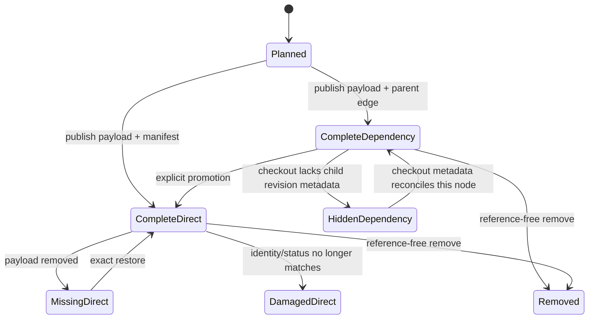

# External installation、link 与 mapping 模型

> 归档状态：`format-illegal`。本页是 DX-REQ-0015 前的历史文档基线，不定义当前产品。

本篇定义一个 Git snapshot 如何成为 owner root 内可恢复的只读内容，以及用户选择的
presentation 如何映射回 source repository。它组合 [root ownership](root-ownership-and-paths.md)
与 [Git source/revision](git-source-revision-and-repository.md)，不改变 doctidex 协议。

## 1. Install identity

Install lookup 使用 owner root、canonical source 与 Revision Request。显式 selector 按 normalized
value 查找；省略 selector 时优先匹配先前由 default intent 创建的 install。命中时复用 stored
selector/commit；未命中时 resolve 为 fixed selector，再形成稳定 Install Key。Install 具有：

| 属性 | 含义 |
|---|---|
| Install ID/path | key 的稳定 opaque identity 与工具分配 root-internal path。 |
| Source | public/canonical source、source relation。 |
| Selector/commit | normalized selector、default provenance、exact resolved commit。 |
| Default provenance | 是否来自省略 selector，以及当时观察到的 default branch；供幂等 lookup 与解释使用。 |
| Role | `direct` 或 `dependency`。 |
| Parents | 显式 dependency parent install IDs 的去重集合。 |
| Managed state | `complete`，或仅 dependency install 可进入的 `hidden`。 |
| Recovery relation | direct install 对应 portable manifest entry；dependency-only 没有。 |

同 key 重试复用 ID/path/commit；不同 selector 通常形成不同 key，default provenance 的物理 key
处理由 Impls 定义。Dependency 请求只增加一条 outer-owner edge，不递归读取 dependency document。Self/cycle 命中既有 key 后停止；dependency
收到普通 direct install 请求时在原 identity 上提升并加入 recovery manifest。

## 2. Recovery Manifest

Recovery Manifest 是 owner root 随 Git 版本化的 portable state，具有 schema、direct installs、
durable links 和稳定内容 identity。Install entry 保存 public source、selector、default
provenance、exact commit 与 stable path；Link entry 保存 target、install、repository-relative
base、safe state 与 responsible index。

Manifest 的公共位置和 serialization 由 interface/Impls 说明。Logical schema `1.0` 要求下列
顶层字段；duplicate key 或未知 schema version 使清单无效。未知字段没有本版本语义，reader
可以保留或忽略，但不能用它替代 required field：

| 字段 | 类型与约束 |
|---|---|
| `schema_version` | string，固定 `1.0`。 |
| `installs` | object；key 是非空 opaque install ID，value 是 PortableInstall。只含 direct install。 |
| `links` | object；key 是 normalized root-relative POSIX target，value 是 PortableLink。 |

PortableInstall 的下列字段 required，只有 `default_branch` 可为 null：

| 字段 | 类型与约束 |
|---|---|
| `install_id` | 必须等于 object key。 |
| `install_path` | 必须为 `/.doctidex/git/installs/<install_id>`。 |
| `source_url` | 非空 sanitized locator，不含 credentials；local locator 的跨环境可恢复程度由 variant 明确。 |
| `source_relation` | 原 owner 的 `host_repository`、`other` 或 `unknown` provenance；restore 不把它当作新 host relation。 |
| `revision_selector` | `{kind: commit|tag|branch, value: non-empty string}`；commit 为 full lowercase object ID。 |
| `default_branch` | string/null；记录省略 selector 时的 provenance，不用于刷新 moving ref。 |
| `resolved_commit` | full lowercase commit object ID，40 或 64 hex。 |

PortableLink 的下列字段 required：

| 字段 | 类型与约束 |
|---|---|
| `target_path` | 必须等于 object key；非空 normalized root-relative POSIX path。 |
| `install_id` | 必须引用同 manifest 的 PortableInstall。 |
| `repository_relative_path` | `.` 或 normalized repository-relative POSIX path。 |
| `safe_state` | `safe` 或 `unsafe`。 |
| `responsible_index` | normalized root-relative POSIX path，basename 必须为 `index.md`。 |

Manifest identity 必须随 logical manifest content 改变而改变，并且不受无语义 formatting
差异影响，以支持 pagination 与 concurrent-change detection。Canonical encoding、hash 和长度
属于 Impls。Install ID 只要求在 manifest 内 opaque、唯一、被 path/link 稳定引用；reader 不能
从 ID 反推 source 或 owner path。

Manifest 不保存 canonical host path、credentials、runtime lookup flag、runtime role/
parent edges、managed state、cache/lock、worktree 或
临时状态。Restore 只重建 manifest 中 direct install 的 exact path/commit；不刷新 moving ref、
不修改 manifest 或既有 symlink，也不递归恢复 dependency-only node。Manifest 中的
`source_relation` 是原安装 provenance；variant 可以在 runtime 另行观察当前 host relation，但
不能把 provenance 误述为权限或 trust。

## 3. Link 与 presentation

Durable Link 具有 owner root、presentation target、source install、repository-relative base、
relative symlink target、safe state、responsible index 与 current/portable records。Target 是用户
选择的 root 内路径；install path 由工具分配，两者不能合并成一个概念。

`complete` payload 至少要求 normal install path、managed record、exact Git HEAD 与 revision
provenance 自洽。`resolved_commit` 是 hard revision fact；`revision_selector`、`default_branch` 和
其他 schema 定义的 revision provenance 是 best-effort alignment facts。commit 已匹配但 provenance
未能安全同步时，payload 不能被描述为 fully aligned，必须保留 field-level outcome。Variant 可以增加
working-tree cleanliness 或更强 ownership checks，并在 Impls 中说明；无法证明当前记录所指 snapshot
时是 `damaged`，缺失 path 是 `missing`。Permission hardening 只实现 logical read-only，不单独证明
complete。Restore 只自动创建 missing payload，对 damaged payload 保留现场。

Link creation 必须证明 source 属于 complete direct install，target 未占用且不 overlap managed
payload，host Git 可以追踪 link/manifest，relative symlink capability 可用。Safe state 要求
source directory 自身是 selected root，full coverage validation 同时得到
`protocol_structure: pass` 与 `scan_complete: true`；semantic candidates 不改变 structural safe
state。其他情况一律 `unsafe`，不从 source presentation 继承。

## 4. Mapping

Mapping Result 连接输入 path 与 repository identity：

| 属性 | 含义 |
|---|---|
| Owner/content root | managed records 的 owner，以及可确定时用于解释 repository suffix 的 content root；两者可能不同。 |
| Source/selector/commit | 对应固定 repository snapshot。 |
| Install/parent | current install 和可选 outer dependency parent。 |
| Repository-relative path | input 在 source repository 内的 normalized path。 |
| Working path | 当前 outer owner 中可访问的实际路径；可能为空。 |
| Target state | available、owner install missing、dependency not installed、damaged 或 unmanaged。 |
| Recovery facts | 是否可 restore，或安装依赖所需 exact facts。 |

Current mapping 来自 owner runtime；Portable mapping 来自 installed content 的 versioned manifest。
Installed symlink target 物理缺失不自动表示损坏：记录自洽且 outer dependency 尚未安装时是
正常 `dependency_not_installed`。只有 identity/path/record 不一致、越 repository 或 ownership
无法证明时才是 damaged。

## 5. Removal reference 与 ownership

Remove 以 selected owner root 内的一个 Install ID 为 target。它同时检查四类阻断 reference：当前
safe Markdown navigation link、filesystem symlink、runtime/portable durable-link mapping，以及其他
install runtime record 中指向 target 的 parent edge。Markdown 与 filesystem discovery 复用
[Tree observations](doctidex-tree-and-configuration.md#6-shared-tree-observations)；managed mapping
与 parent edge 仍由 external state 解释。

Markdown/symlink discovery 不递归进入 install payload、boundary-set 内部或 unsafe 内部。这个
external remove 的产品 exclusion 不改变 protocol 对 boundary/unsafe 的解释。所有发现的 target
reference 都阻断 remove；命令保留 payload、manifest/runtime、presentation 和 root configuration，
并给出可定位的 reference evidence。它不删除引用来完成 remove。

没有 target reference 时，remove 只处置该 owner root 的 exact install payload 与 per-install
runtime/portable metadata。target 作为 other install 的 parent 不阻断删除；target 的自身 parent
edges 随其 runtime record 一同移除。Shared source cache、`.gitignore`、internal namespace
frontmatter 与其他 root-shared layout 不属于 remove effect。

## 6. 状态机

Install lifecycle 与 link relation 分开：Install role 是 `dependency` 或 `direct`；promotion 只允许
dependency -> direct。Payload state 是 `planned`、`complete`、`missing`、`damaged`，以及仅 dependency
install 的 `hidden`。restore 只执行 missing -> complete；damaged 必须先由用户处理，不能被自动覆盖。
一个 direct install 可以被零到多个 Durable Links 引用；link 的新增/缺失不改变 install role 或
payload state。

`hidden` 表示 hook 在当前 checkout 无法从一个已对齐 direct ancestor 的 doctidex manifest 取得该
dependency node 的 revision metadata。它必须保留 runtime parent edges 和实际 Git worktree，但从 normal
install path 迁移到不被 normal mapping 或 symlink 命中的 managed location；hidden node 不可成为 durable
link source。每次 hook 都重新判定所有 hidden nodes：无法重新进入可处理 forest 时保持 hidden，找到
有效 child metadata 时只有该 node 返回 complete。其 descendants 独立重新判定，不因 parent unhide
而自动恢复。

Hook Registration 连接一个 owner root、其 Host Git Repository 和该 repository 的 `post-checkout`
trigger。`hook --install` 为该 registration 建立可重复的 entrypoint；一个已存在且非本产品管理的
`post-checkout` hook 是可观察 conflict，不能被覆盖。Hook run 只消费 registration 所选 owner root 的
current manifest/runtime，不把 host repository 的其他 roots 纳入隐式范围。

Install、frontmatter、ignore、manifest、runtime、payload 与 symlink 是独立 publication effects，
不存在跨资源 transaction。结果应在可可靠确定时列出已完成效果；否则必须列出 affected
identity/path，并要求调用方重新观察后再按同 identity 重试。
