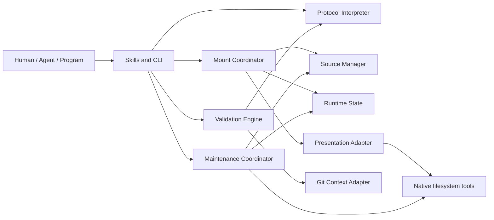
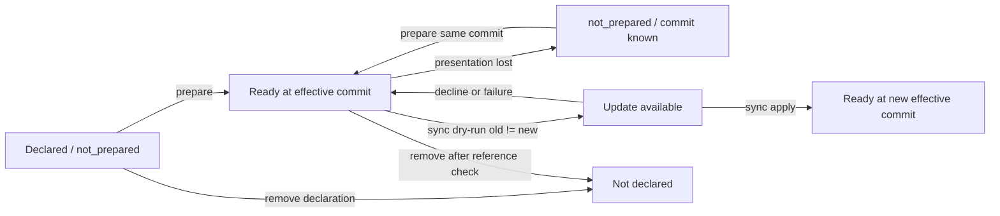
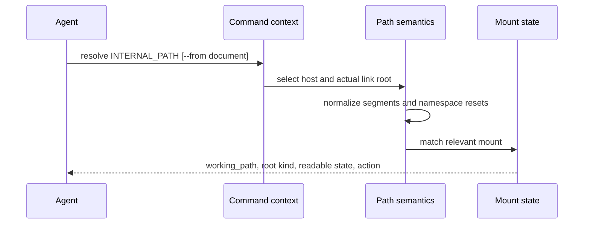
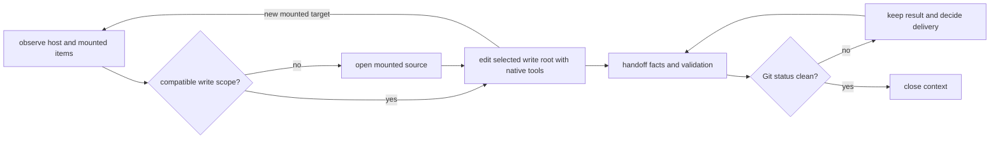

# doctidex-git 0.1.0 子系统与生命周期

本文说明语言无关的职责划分，以及公开操作如何跨子系统完成。Python 模块映射见
[Python 包与模块地图](../impls/python/package-and-module-map.md)。

## 1. 子系统职责

| 子系统 | 负责 | 不负责 |
|---|---|---|
| Surface Orchestrator | 参数上下文、命令编排、preview/apply、batch、结果预算和渲染 | 内容语义判断、Git 交付决策。 |
| Protocol Interpreter | Markdown/frontmatter、根、路径、过滤、index/log 责任、基础 mount 与结构校验 | Git revision、远端访问、用户任务相关性。 |
| Git Context Adapter | worktree 发现、Git status、root ignore/readiness | doctidex 内容语义、source 生命周期。 |
| Source Manager | source identity、Git object 获取、selector 解析、revision snapshot、maintenance checkout | host mount declaration 和用户输出。 |
| Mount Coordinator | Git extension 校验、declaration 生命周期、effective commit、prepare/sync | 直接修改 mounted source 内容。 |
| Presentation Adapter | 把 revision snapshot 作为只读逻辑 mount path 提供给原生工具 | 定义 public path 语义或要求用户选择呈现技术。 |
| Maintenance Coordinator | root relation、scope 复用建议、open、status、handoff、close 和 owning host 关联 | 判断任务交付兼容性、commit、push、merge、跨 scope 原子回滚。 |
| Validation Engine | protocol findings、semantic candidates、plugin readiness | 生成 index/log 内容或最终审阅结论。 |
| Runtime State | 保存 effective selection 和开放 maintenance contexts | 成为用户配置、协议内容或公共查询 API。 |

依赖方向遵循“surface 编排 domain services，Git services 复用 protocol facts”。Protocol
Interpreter 不依赖 Git；Presentation 不能改变 Protocol 定义的路径语义。

## 2. 整体关系



公开工作流从 Skills/CLI 进入。用户最终仍通过 native filesystem/Git tools 读取、编辑和
审阅；内部服务只建立可信上下文和生命周期。

## 3. Root Selection 生命周期

1. 接收 cwd 和 command-specific path。
2. 发现包含该路径的 doctidex roots。
3. exact root directory 优先；无 root 返回 not found；多个未明确 root 返回 ambiguous。
4. inspect 可以在目标仍位于当前 host 时保留 host context。
5. resolve 可以用 link document 选择 mounted source link root。
6. exact maintenance root 可以恢复 owning host context。

选根结果必须进入公开 payload；内部 state 不能静默改变用户选择。

## 4. Mount 生命周期



### 4.1 Add

add 验证 root、mount path、source、selector、ignore/readiness 和重叠。preview 不修改 root
index；apply 只添加 declaration，仍保持 lazy，不解析远端或创建可读内容。

### 4.2 Prepare

prepare 优先复用 declaration 对应的 effective commit。未知时解析 selector，确保 source
root 有效，建立只读 snapshot 和 host presentation，然后保存 effective selection。它不
改变 declaration，也不追踪 branch/tag 的远端移动。

### 4.3 Sync

sync 显式刷新 selector。dry-run 可以联网并报告 old/new，但不切换读取结果；apply 在
新旧不同且 host readiness 满足时发布新 presentation。失败且旧 commit 可读时必须保留
旧结果。

### 4.4 Remove

remove 先检查可解析文档引用。apply 移除 declaration 和受管理 presentation；它不能
删除不确定归属的用户内容，也不保证立即回收共享 source 数据。

## 5. Link Resolution 生命周期



resolve 不读取目标文件、不验证 link 是否存在于 source document，也不 prepare。它只把
已知上下文转换为原生工具可用路径和 mount facts。

## 6. Maintenance 生命周期



### 6.1 Scope

scope 把本次 task paths 去重为 host root 和 mounted source 观察项，返回 selector、
base commit、target branch、read/write 边界、root relation、maintenance reuse 和必要的
open action。item 不记录待分配或已分配状态；agent 用这些事实创建、复核或调整自己的
写入范围计划。

scope 可以在同一维护工作中重复运行，每次只反映调用时的现场，不持久化或覆盖 agent
计划。相同 source/base commit 形成合并候选；scope 排除两侧都已知且不同的 branch，
但不创建 context，也不判断权限、未知 branch 的完整交付意图或依赖顺序。agent 选定
写入根后只能在该根边界内执行；发现其他 mounted source 时回到 scope 判断，而不是沿
mount 直接扩大当前范围。

### 6.2 Open

open 要求 mount 已有 effective commit。它创建与只读 presentation 隔离的 writable
source root，记录 owning host、base commit 和 target branch hint。host 当前读路径不变。
若调用前已有兼容 scope，显式 open 仍创建隔离现场并返回 warning；这保留用户主动隔离
能力，同时让默认工作流在 open 前优先复用。

### 6.3 Status and Handoff

status 根据当前 Git changes 计算 ready/has_changes。handoff 针对一个 exact context，
组合 source 自身的 protocol validation、semantic candidates、plugin readiness 和 changes。
两者不提交或推送。

### 6.4 Close

close 只接受 Git-clean context。有 changes 时必须 blocked 并保留结果；clean 时关闭该
context。用户如何交付或丢弃变化不由 close 决定。

## 7. Validation 生命周期

```text
protocol traversal ------> deterministic findings ------> pass/fail
index + Git evidence ----> semantic candidates ---------> clear/required
Git ignore/index state --> readiness facts -------------> ready/blocked/N/A
```

三路在 surface 合并但不互相覆盖。online check 可增加 remote selector facts，不得切换
effective commit 或自动 prepare。

## 8. 并发与非原子边界

- 同一 source 的 fetch/snapshot/maintenance 创建必须串行保护共享 Git 数据。
- 同一 host 的 mount declaration 和 presentation 变更必须串行。
- state 发布与 presentation 发布应具备原子替换边界。
- batch mount 和多根维护逐项提交结果，不提供全局事务。
- 中断或单项失败必须保留已经完成的独立结果并在 payload 中可见。
