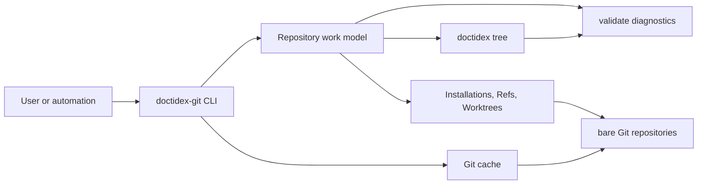
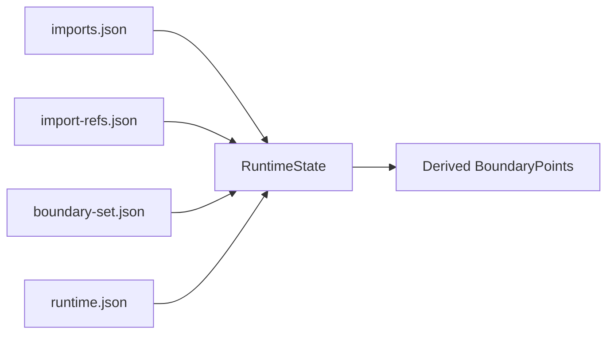
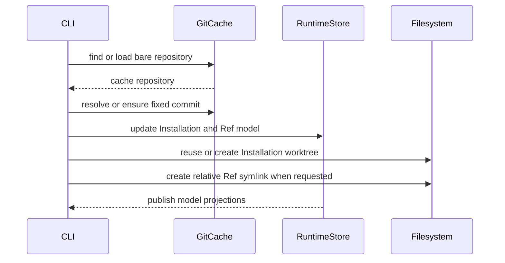

# doctidex-git v2 Architecture

## 1. Purpose And Scope

doctidex is a simple directory-tree convention: `index.md` supplies reading navigation. `doctidex-git` applies that convention to a Git repository. Its product direction is "Git repos also a doctidex tree": a repository remains ordinary source and history while also becoming a knowledge-base tree that explains itself and evolves with development.

`doctidex-git` gives one Git repository a local work model for fixed-revision Installations, managed symbolic Refs, editable Worktrees, and their relationship to doctidex boundaries.

The [doctidex v2 directory tree appearance specification](doctidex-v2-directory-tree.md) remains the authority for root identity, `index.md`, Markdown links, and the abstract meaning of `boundary-set`. This document defines how doctidex-git supplies concrete boundaries and Git-backed state without changing those directory-tree semantics.

The product is a Linux/macOS command-line tool. It is not a hosted service, a replacement for Git, or a general-purpose database for repository files. Its design direction is to keep a repository readable as ordinary files while making fixed external revisions and cross-repository development locations explicit, navigable, and reproducible from recorded metadata. Its user-facing contract is described in [the user guide](../user/doctidex-git-v2.md); this document describes the current design, ownership boundaries, and constraints rather than replaying the Requirement's incremental history.



## 2. Architectural Boundary

One Git root is the boundary for a command, its repository-local work model, repository-internal paths, and the doctidex tree it observes. `--repos-path` must name that Git root exactly; when omitted, the CLI discovers the enclosing root from the current directory.

A repository-internal absolute path begins with `/`, but this slash is rooted at the selected Git root rather than the host filesystem root. Path normalization may collapse internal `.` and `..`, but must reject a path that escapes the repository.

The work model is not a representation of all repository files. It owns only the domain records below, their explicitly managed paths, and the boundaries derived from them. Ordinary content, normal Git development, and user-created worktrees remain outside its ownership.

## 3. Domain Model

### 3.1 Installation

An Installation represents one external Git source at one fixed commit and one repository-local installation path. It remains addressable even when its physical worktree is absent.

| Field | Meaning and responsibility |
|---|---|
| `tracked` | Selects the persistent projection: `true` belongs to Git-tracked `imports.json`; `false` belongs to ignored `runtime.json`. |
| `git-url` | Identifies the external repository and the cache record that supplies its objects. |
| `commit-hash` | Immutable revision used to create or restore the worktree; a branch or tag resolves to it once. |
| `install-id` | Stable identifier for CLI selection and Ref ownership. |
| `install-path` | Repository-internal physical worktree path; derives an `import` BoundaryPoint. |
| `keys` | Search metadata for user-facing `import query`. |
| `branch`, `tag` | Optional selector provenance. At most one is nonempty; a direct commit has neither. |

`import install` creates an Installation as tracked or untracked. `import track` and `import ref` can promote it to tracked. A tracked record may legitimately outlive its physical directory after a clone; `import restore` recreates that directory from the recorded commit. `import remove` ends its lifecycle only after its Ref and Markdown-link dependencies permit removal.

Branch and tag selectors are resolution inputs, not live tracking relationships. Re-running one observes its current remote commit and replaces a changed Installation; a direct commit reuses a matching URL-and-commit Installation.

### 3.2 Ref

A Ref is a tracked declaration that a `target-dir` is a symbolic link to the root, or a `src-sub-dir`, of one tracked Installation.

| Field | Meaning and responsibility |
|---|---|
| `install-id` | The owning Installation. A Ref is invalid without an existing tracked Installation. |
| `src-sub-dir` | Empty for the Installation root, otherwise an absolute path inside that Installation. |
| `target-dir` | Repository-internal link location and source of an `import-ref` BoundaryPoint. |

The link text is relative from the target parent to its source, preserving repository portability. Creating a Ref promotes its Installation to tracked in the same model update. Removing it is blocked while an in-scope Markdown link crosses the Ref BoundaryPoint.

### 3.3 Worktree

A Worktree is a managed, always-untracked editable Git worktree. Its record describes origin and creation base, but does not claim to track later commits made inside it.

| Field | Meaning and responsibility |
|---|---|
| `url` | Source Git URL used to verify the physical worktree. |
| `install-id` | Optional Installation source; absent for a URL-created Worktree. |
| `base-commit-hash` | Commit checked out at creation; not a moving tracked commit. |
| `work-path` | Repository-internal worktree directory and source of a `worktree` BoundaryPoint. |

An Installation source uses its recorded commit. A URL source resolves a branch, tag, or commit once. Default work paths are under `/.doctidex-git/worktrees/<domain>/<repository-path>/<tree-name>`; a custom work path receives a tool-managed Git ignore rule. Removing an unrecorded or already-missing Worktree is idempotent; a recorded dirty worktree needs the explicit `--force` request before its directory is removed.

### 3.4 BoundaryPoint

A BoundaryPoint is doctidex-git's concrete input to the directory-tree specification's abstract `boundary-set`. It is never a second independent source of truth.

| Type | Source | Persistence and lifecycle |
|---|---|---|
| `custom` | `boundary-set add` | Stored in tracked `boundary-set.json`; removable by `boundary-set remove`. |
| `import` | `Installation.install-path` | Derived whenever the Installation exists. |
| `import-ref` | `Ref.target-dir` | Derived whenever the Ref exists. |
| `worktree` | `Worktree.work-path` | Derived whenever the Worktree exists. |

When paths overlap, resolution chooses the first ancestor encountered from the Git root and does not continue below it. The complete BoundaryPoint view is rebuilt from the current RuntimeStore state.

### 3.5 InlineAnnotation And MarkdownLink

`InlineAnnotation` is structured metadata attached to one Markdown link. Its current field, `cross-boundary-point`, records the first BoundaryPoint crossed by the link.

`markdown-it-py` recognizes Markdown links; shared model tooling then resolves local paths, source lines, first crossed BoundaryPoints, and Installation/Ref associations. From the link source end it examines only the following contiguous HTML-comment sequence and selects the first valid `doctidex` YAML mapping.

The annotation preserves the link's absolute or relative path form. It must be a full path-segment prefix of the link path; only after resolving relative to the source document may it be compared with the repository-internal BoundaryPoint. This avoids false equality across path coordinate systems.

### 3.6 CacheItem

A CacheItem is an internal record for one cached bare repository.

| Field | Meaning and lifecycle |
|---|---|
| `git-url` | Unique source identity for a cache record. |
| `path` | Relative path below the cache root, arranged as `<domain>/<repository-path>`. |
| `status` | `preparing` before a bare clone completes and `published` when the repository is usable. |

`preparing` remains persistent after interruption. A later cache transaction removes the associated validated cache-local directory and record, then permits a new load. Bare Git object changes are not treated as reversible database writes.

## 4. State Ownership And Projection

### 4.1 Repository-local workspace

```text
<git-root>/
├── index.md
└── .doctidex-git/
    ├── config.toml
    ├── boundary-set.json       # tracked custom BoundaryPoints
    ├── imports.json            # tracked Installations
    ├── import-refs.json        # tracked Refs
    ├── runtime.json            # ignored untracked Installations and Worktrees
    ├── imports/                # ignored physical Installation worktrees
    ├── worktrees/              # ignored default Worktrees
    ├── .transactions/          # ignored RuntimeStore journals
    ├── .lock
    └── .command.lock
```

`index.md` and its required frontmatter are model structure because they establish the doctidex root to which the model applies. `init` creates a missing root index or supplements missing fixed fields without changing unrelated frontmatter or body content.

`RuntimeStore` reconstructs a full RuntimeState from tracked files and `runtime.json`:



The tracked projection contains only `tracked: true` Installations. The runtime projection contains only `tracked: false` Installations and all Worktrees. Refs and custom BoundaryPoints are tracked. This preserves reproducible declarations without committing machine-local Git worktrees.

| RuntimeState field | Role |
|---|---|
| `installations` | The merged tracked and untracked Installation collection; it is the source for installation lookup, ownership, and derived `import` boundaries. |
| `refs` | The tracked Ref collection; it connects publicly linked locations back to Installations and derives `import-ref` boundaries. |
| `custom-boundary-points` | The tracked custom BoundaryPoint collection. Only `custom` records are legal here. |
| `worktrees` | The ignored Worktree collection and source of derived `worktree` boundaries. |

### 4.2 User-level cache

The default doctidex-git home is `~/.doctidex-git`; `DOCTIDEX-GIT-HOME` may select another home. Its `config.toml` can set `cache-path`, otherwise the cache is `<home>/cache`. `status.json` is the CacheStore authority for CacheItems, while bare repositories below the cache root are physical cache objects.

`GitCache` is the only internal entry point for a cached bare repository. A cache hit starts with a read-only transaction. A miss ends that transaction and opens a write transaction to register a `preparing` record, clone the bare repository, then publish it. Revision resolution and worktree creation remain inside the selected cache transaction.

## 5. Consistency And Recovery

Neither Store is a database transaction. Their objective is recoverable model state under cooperating doctidex-git processes, not reversal of every filesystem or Git side effect.

| Store | Publication unit | Failure recovery |
|---|---|---|
| CacheStore | One `status.json` replacement | On entry, discard `preparing` records and their validated cache-local directories. |
| RuntimeStore | Coordinated replacement of RuntimeState files | A journal holds old/new hashes and backups so repair can classify interrupted publication and converge the files. |

RuntimeStore read-only access only locks and reads; it does not create a journal or expose state replacement. A write transaction records its journal at entry, stages the next file contents, atomically replaces the state files, marks the journal committed, then cleans it up.

Initialization is intentionally different: it completes a new workspace in a system temporary directory and then synchronizes it into an absent or empty target. It does not create a Git-visible initialization scratch directory or use a RuntimeStore journal. An interrupted initialization leaves a nonempty workspace for explicit `validate` rather than a later `init` overwrite.

A normal RuntimeStore transaction detects a residual journal while acquiring its lock, releases the lock, and reports an internal repair-required signal. It does not recover JSON or open GitCache from inside its entry path.

`StoreCoordinator` serializes one workspace command with `.command.lock`, invokes repair outside the failed RuntimeStore transaction, then retries the actual operation. An existing GitCache write transaction is reused; a read-only transaction is exited before write access opens. The retry limit is three; exhaustion becomes a structured Store failure.

Repair classifies the residual journal and uses backups as needed to make JSON coherent. Only an already committed residual may skip physical repair. Every other residual is kept until model and physical repair finish successfully, making a second interruption detectable.

The product coordinates only doctidex-git CLI processes that follow its lock and transaction protocol. Commands needing both domains acquire cache access before RuntimeStore access. The command lock covers residual detection, repair, and retry for one workspace.

No race-safety guarantee is made for users, editors, or unrelated programs directly modifying model JSON, cache state, ignore files, or managed directories. Snapshot comparisons are not presented as an incomplete defense against those external writes.

## 6. Core Workflows

### 6.1 Initialization And Structure

`init` establishes root identity, initial projections, and Git ignore protection. A nonempty workspace is treated as already initialized: the user chooses `validate --model-structure` or `repair` rather than allowing initialization to guess which existing state should win.

The structure validation checks workspace artifacts, JSON shape and projection placement, unique identities, record relationships, managed-path conflicts, ignore protection, and root-index identity.

### 6.2 Installation And Ref



`install` and `restore` share installation-path preparation. A missing path is created. An uncontrolled residue is replaced. A same-URL detached clean worktree is reused at the required commit. A different-URL worktree is never overwritten; a same-URL path that is unsafe to reuse is removed and recreated. `restore` never re-resolves branch or tag.

Deletion is relationship-aware. A tracked Installation cannot be removed while an in-scope Markdown link crosses its `import` BoundaryPoint, crosses an associated `import-ref` BoundaryPoint, or an associated Ref remains. A Ref cannot be removed while a link crosses its boundary. Missing selected records are otherwise idempotent delete requests.

### 6.3 Worktree

Worktree creation resolves a source commit, checks that the bare repository contains it, creates a detached Git worktree, and records only source and creation base. Default path selection retries short random names until no recorded or physical collision exists. An explicit path or tree-name collision is an error because changing a user-selected path would change user intent.

Removing a recorded Worktree deletes its managed directory and record. Git's bare-repository worktree registration is pruned before later creation; removal does not need cache access.

### 6.4 Validation, Repair, And Links

`validate` is read-only. It reports a work-model diagnostic before content diagnostics because an untrustworthy model cannot safely drive a complete Markdown scan. Full validation checks root identity, state projections, physical Installations, Refs, Worktrees, ignore protection, local link targets, cross-boundary annotations, and tracked-Installation requirements. It scans neither `.doctidex-git` nor descendants of a BoundaryPoint as tree content.

When a tracked Installation directory is absent, validation still checks the installation identity and does not restore it or demand link-target existence below it. That is an expected post-clone state for tracked metadata.

`repair` is maintenance, not history rollback. JSON records are its baseline. It recreates missing or inconsistent Installation directories, Refs, and Worktrees where possible; removes an unrecorded link into an Installation; removes a Ref whose Installation no longer exists; and reconciles derived boundaries and ignore rules. It does not inspect or modify Markdown link content.

## 7. Implementation Responsibilities

These are internal ownership boundaries, not an additional public API.

| Area | Responsibility | Implementation |
|---|---|---|
| CLI envelope | Arguments, JSON results, exit status, Git-root command adaptation | [`cli/main.py`](../../src/python/whero/doctidex/cli/main.py), [`cli/results.py`](../../src/python/whero/doctidex/cli/results.py) |
| Core records | Model parsing and serialization | [`model.py`](../../src/python/whero/doctidex/model.py) |
| Shared model relations | Indexed views, boundary derivation, directory scans, links and annotations | [`model_view.py`](../../src/python/whero/doctidex/model_view.py) |
| Store protocol | Locks, atomic replacement, Runtime journals, cache records | [`store/`](../../src/python/whero/doctidex/store/) |
| Git source access | Root and revision resolution, target-commit availability, cached repositories | [`repository.py`](../../src/python/whero/doctidex/repository.py), [`git_cache.py`](../../src/python/whero/doctidex/git_cache.py) |
| Command workflows | Initialization, boundaries, imports, worktrees, validation and repair | [`initialization.py`](../../src/python/whero/doctidex/initialization.py), [`boundary.py`](../../src/python/whero/doctidex/boundary.py), [`imports.py`](../../src/python/whero/doctidex/imports.py), [`worktree.py`](../../src/python/whero/doctidex/worktree.py), [`validate.py`](../../src/python/whero/doctidex/validate.py), [`repair.py`](../../src/python/whero/doctidex/repair.py) |
| Cross-store recovery | Command lock, cache/runtime sequencing, repair retry | [`coordination.py`](../../src/python/whero/doctidex/coordination.py) |

Model views own shared relationship semantics. Command modules own policy: whether a relationship blocks deletion, creates a diagnostic, or triggers physical repair. This avoids divergent interpretations of the same Installation, Ref, BoundaryPoint, or Markdown link.

## 8. Constraints And Tradeoffs

- The CLI returns machine-readable JSON. `validate` uses `valid` and diagnostics for expected invalid state; operational failures use structured error codes and exit status 2.
- Markdown syntax recognition uses the declared CommonMark parser. Source location and boundary logic supplements parser-recognized links rather than redefining Markdown syntax.
- Git cache accelerates and supplies operations but does not replace RuntimeStore as the authority for Installation, Ref, or Worktree declarations.
- Git fetches, bare object additions, and user commits are real external side effects. Recovery converges doctidex-git's declared state and managed paths; it does not undo those effects.
- Repair seeks compatibility between JSON declarations and physical state, not restoration of a pre-failure filesystem snapshot. Document-authored link corrections remain the user's task.
- The Python package is `whero.doctidex` under `src/python/whero/doctidex/`. `whero` is a shared namespace package, not a project-exclusive top-level package.
