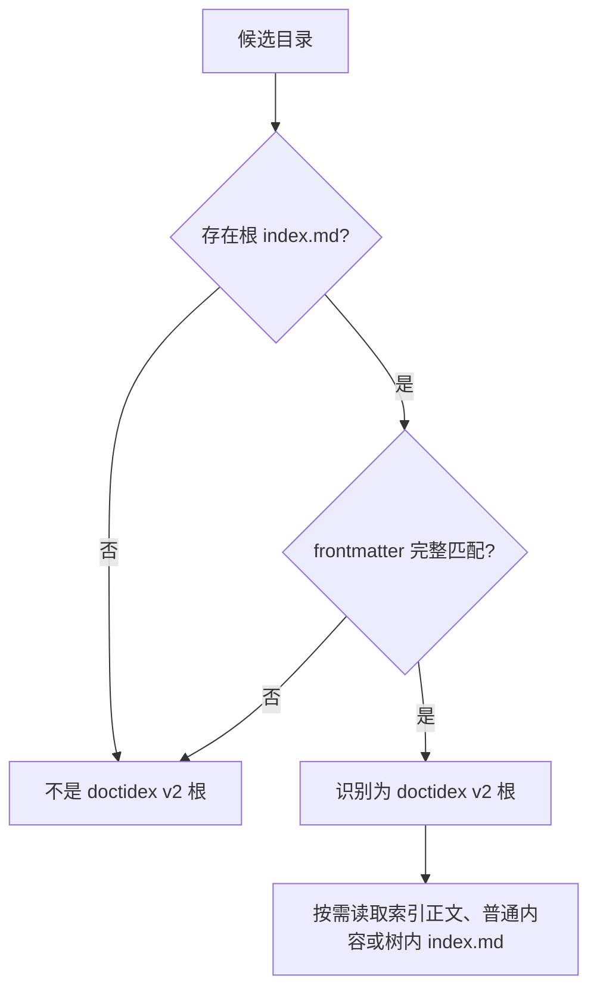
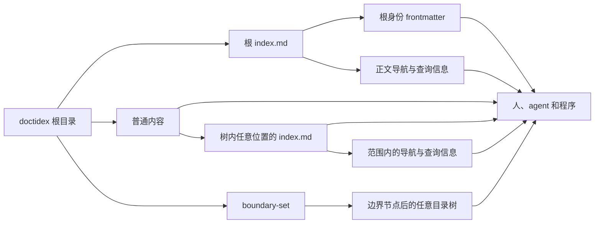

# doctidex v2 目录树外观规范

本文定义 doctidex v2 目录树的外观。它是用户、agent 和程序可直接依赖的可观察契约，
并规定目录树的 user surface 与 Architecture。本文中的“必须”表示符合本规范所需满足的
约束。

## 1. 目的与心智模型

doctidex v2 将目录树视为普通文件系统内容，而不将其包装为专用容器。一个目录以根目录
中的 `index.md` 作为唯一强制入口；该文件的 frontmatter 声明目录树身份，正文承担渐进式
披露、导航和查询入口的责任。`index.md` 也可以按需出现在当前 doctidex 目录树范围内的
任意位置，且不要求从根到该文件的祖先路径连续出现 `index.md`。除根入口外，目录树可以
承载任意普通内容，
读取者仍可用常规文件工具查看和编辑这些内容。

基础目录树模型包含以下五个概念：

| 概念 | 含义 | 对读者的作用 |
|---|---|---|
| doctidex 根 | 包含根 `index.md` 的目录 | 提供目录树的起点 |
| 根入口 | 根目录中的 `index.md` | 声明该目录是 doctidex v2 根 |
| 索引文档 | 当前 doctidex 目录树范围内任意位置的 `index.md` | 可被按需读取，没有祖先索引连续性要求 |
| 索引正文 | `index.md` 的 Markdown 正文 | 提供渐进式披露、导航和查询信息 |
| 普通内容 | 根入口之外承载的文件与目录 | 承载目录树中的其他内容，不改变根入口身份 |

```text
<doctidex-root>/
├── index.md                     # 唯一强制的根入口
└── <ordinary-content>/
    └── <any-depth>/
        └── index.md             # 可以按需出现
```

根 `index.md` 的正文提供概览、导航和查询入口；其他位置的 `index.md` 可以承担相应范围
的信息分层职责。

## 2. 公共目录树模型

### 2.1 根目录

一个目录要被识别为 doctidex v2 根，必须直接包含名为 `index.md` 的文件。该文件必须位于
根目录，不可由其他路径、文件名或普通内容替代。

根入口之外的普通内容可以存在。本规范不为这些内容定义额外的目录树语义；它们是否
存在不影响根的识别。

### 2.2 索引文档的位置

在未越过 `boundary-set` 的当前 doctidex 目录树范围内，`index.md` 可以位于任意位置。除根目录
中的根入口外，索引文档可以按需添加；其所在目录的任意祖先目录均无需强制包含 `index.md`。
因此，读取者可以直接读取目标
索引文档，不必先检查或补齐从根到目标的索引链。

越过 `boundary-set` 后的路径属于边界外部范围，不再适用本节的 `index.md` 位置规则；其中
出现的 `index.md` 按目标目录树自身的规则解释。

该位置规则不改变根身份：只有根目录直接包含的、满足第 2.3 节约束的 `index.md` 才声明
doctidex 根。本规范不为非根位置的 `index.md` 强制增加额外字段，正文遵循第 2.4 节的规则。

位置选择仍应考虑目录的稳定性和既有约定。不建议将 `index.md` 放置在具有自有规范或频繁
变化的临时性目录中，例如某些工具的配置目录、源码目录或临时工作区。这是位置选择建议，
不构成对 `index.md` 任意位置规则的禁止或额外符合性条件。

### 2.3 根入口文档

根 `index.md` 必须具有下列基础 frontmatter：

```yaml
---
type: index
doctidex:
  type: index
  root: true
---
```

| 字段 | 类型与固定值 | 责任 |
|---|---|---|
| `type` | 字符串 `index` | 将文档标识为索引文档。 |
| `doctidex.type` | 字符串 `index` | 将索引文档标识为 doctidex 入口。 |
| `doctidex.root` | 布尔值 `true` | 声明该入口所处目录为 doctidex 根。 |

三项字段共同构成根身份。缺少任一字段、字段类型不符或值不符时，`index.md` 不声明
doctidex v2 根。

### 2.4 `index.md` 正文职责

`index.md` 正文是 user surface 的导航和查询入口，必须提供足够的信息支持渐进式披露、
导航和查询。正文组织没有固定格式；作者可以根据内容和读者任务选择段落、表格、代码块
或其他 Markdown 结构来组织信息。

当单个 `index.md` 中的索引信息过于杂乱、分散注意力时，可以在当前 doctidex 目录树范围内
的子代目录合适位置建立新的 `index.md` 进行信息分层。该分层按需发生，不要求每个目录都有
`index.md`，也不要求祖先路径连续出现 `index.md`。

`index.md` 的导航 link 遵循以下规则：

| 规则 | 约束 |
|---|---|
| 覆盖范围 | 不要求覆盖范围内的所有文档，也不要求追求客观的 link 覆盖率。文档自身已经提供有效导航时，可以直接利用，不必为覆盖率额外重复链接。 |
| 重复出现 | 没有一个文档 link 只能出现一次的要求。同一文档 link 可以多次出现在其 ancestor `index.md` 中，只要有助于优化导航或查询效果。 |
| 导航与关键文档 | `index.md` 链接已有导航性质的文档时，也可以额外链接其中的关键文档，只要有助于优化导航或查询效果。 |
| 链接范围 | link 通常指向 `index.md` 所在范围内的文档，这是最佳实践；但不禁止链接其他范围内的文档。 |

### 2.5 `boundary-set` 规则

`boundary-set` 是当前 doctidex 目录树中 escape 节点（目录）的抽象集合。v2 定义该集合及
其边界语义，但不在 frontmatter 中定义用于存储或声明它的字段，也不规定其他具体声明机制。
本规范所称当前 doctidex 目录树有效范围，是从根目录出发且路径尚未越过该集合中节点的范围。
集合中的每个节点标识当前目录树的 escape 边界；路径越过该节点后，当前目录树的 link、
`index.md` 和其他结构规则不再适用。边界节点后的路径可以是任意目录树，包括另一个
doctidex 目录树或其子目录树。边界只界定当前目录树规则的适用范围，不限制当前目录树内
Markdown 文档建立跨界 link；这些文档仍可以 link 到越过任一 `boundary-set` 节点后可达的
任意外部文档。

### 2.6 目录树 Markdown 文档的 link 规则

以下 link 规则适用于当前 doctidex 目录树规则有效范围内的所有 Markdown 文档，不仅适用于
`index.md`。

所有这些 Markdown 文档都可以使用 Markdown link 配合常用 anchor 链接目标文档和目录。例如：

结构化 link 注释的 HTML/YAML 形式、link 后的关联位置和字段语义由本节定义。

```markdown
- [主题目录](topics/)
- [主题概览](topics/index.md#overview)
- [关键文档](topics/decision.md#scope)
- [根范围文档](/topics/decision.md#scope)
```

link path 以 link 所在文档的 doctidex 目录树根解释：以 `/` 开头的 path 从该根目录开始，
不以 `/` 开头的相对 path 则按 Markdown 文档所在位置解释。表达同一目标时，鼓励优先使用
相对路径，以简化 link 表达。

link 的组织规则如下：

| 规则 | 约束 |
|---|---|
| 路径根 | 以 `/` 开头的 link path 以当前所在 doctidex 目录树的根目录作为根目录解释。 |
| 路径表达 | 鼓励使用相对路径简化 link 表达；这是表达偏好，不增加额外的符合性条件。 |

#### 2.6.1 结构化 link 注释

结构化 link 注释附着于单个 Markdown link，使用 HTML 注释承载 `doctidex` YAML 映射，支持
flow mapping 和 block mapping：

```markdown
[External](/external/guide.md)
<!-- doctidex: {cross-boundary-point: /external} -->
```

```markdown
[External](/external/guide.md)
<!-- doctidex:
  cross-boundary-point: /external
-->
```

注释位于 link 后的连续 HTML 注释序列中；link 与首个注释、相邻注释之间可以只有空白，
遇到其他内容时关联结束。`doctidex` 后的 YAML 必须是无重复键的映射。一个 link 的关联序列最多包含一个 `doctidex` 注释；其他注释
可以与它共存。为支持渐进式读取，`doctidex` 注释应放在序列首位。

`cross-boundary-point` 字段定义如下：

| 字段 | 要求与语义 |
|---|---|
| `cross-boundary-point` | 路径字符串，形式为 link path 中包含该 `boundary-set` 节点的路径前缀；该节点属于包含 link 所在文档的 doctidex 目录树。 |

## 3. 识别、读取与创建流程

### 3.1 识别与读取

人、agent 或程序面对一个候选目录时，按以下流程确定其是否为 doctidex v2 根：



流程的输入是候选目录；输出是明确的根识别结果。识别失败时，读取者应报告缺失或不匹配
的入口条件，并可在修正 `index.md` 后重新识别。根被识别后，读取者可以按任务需要读取
入口正文、普通内容或当前 doctidex 目录树范围内任意位置的 `index.md`，不必经过专用读取工具，
也不必检查目标 `index.md` 的祖先目录是否存在其他 `index.md`。读取者可以根据当前任务沿正文 link 渐进式
展开，也可以直接利用目标文档已有的导航。link 越过 `boundary-set` 节点后，读取者不再
将当前目录树的 link、`index.md` 或其他结构规则应用到边界节点后的路径；目标路径由其
自身的目录树规则解释。

### 3.2 创建最小根

创建者建立目录后，在其根目录创建 `index.md`，并写入第 2.3 节的完整 frontmatter。此时
目录已经具备 doctidex v2 根身份；创建者可随后加入普通内容，编写根入口
正文，并在当前 doctidex 目录树范围内需要分层时于任意位置加入 `index.md`，而无需先在其
祖先目录创建 `index.md`。

## 4. 责任与约束

目录树模型的责任关系如下：



| 所有者 | 责任 | 约束 |
|---|---|---|
| 根目录 | 提供可观察的结构边界 | 必须直接包含 `index.md`。 |
| 根入口 | 声明目录树身份 | 必须使用第 2.3 节的字段、类型和值。 |
| 索引文档 | 在当前目录树有效范围内任意位置提供可读取的索引文档 | 不要求祖先目录连续包含 `index.md`。 |
| 索引正文 | 提供渐进式披露、导航和查询信息 | 没有固定组织格式；需要分层时可以在子代目录按需建立 `index.md`。 |
| `boundary-set` | 标识当前目录树的 escape 节点 | 节点后的路径可以是任意目录树，当前目录树规则不再适用；不限制树内文档建立跨界 link。 |
| 目录树 Markdown 文档 | 使用统一的 link 语义连接文档和目录 | `/` path 从当前 doctidex 根解释，鼓励相对路径；适用于当前规则有效范围内的所有 Markdown 文档。 |
| 普通内容 | 承载目录树的实际内容 | 可以存在，且不替代根入口。 |
| 读取者 | 根据入口识别根并读取所需内容 | 不得把普通内容误作根入口。 |
