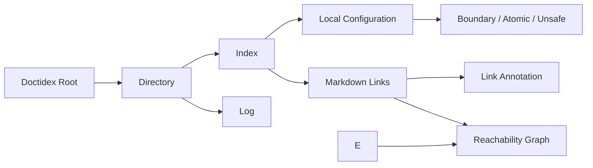

# doctidex tree 与 configuration 模型

本篇定义 doctidex-git 如何理解一个 doctidex tree。协议规范仍以
[`spec/overview.md`](../../../../spec/overview.md) 为唯一权威；这里定义产品为了 validation、
external presentation 和 agent workflow 必须持有的语言无关模型，不增加协议规则。

## 1. 模型关系

Root 是所有 root-absolute path、最近负责制与 reachability 的解释边界。Directory 是 tree
中的逻辑目录；Index 是其内容与下级组织的负责文档；Log 记录该目录的可选变更入口。普通
Markdown document 是可导航内容，但不因被读取而获得配置 authority。

## 2. Document 与 directory

| 概念 | 必需属性 | 关系与不变量 |
|---|---|---|
| Root | filesystem location、root index、tree-relative `/` | 一个 operation 只产生一个 selected root；`/` 从不表示宿主 filesystem root。 |
| Directory | root-relative path、physical availability、responsible index | 最近存在且适用的 index 负责当前目录；嵌套 index 开始新的责任范围。 |
| Index | path、frontmatter、body、links、local configuration | `type: index` 与 doctidex mapping 可被机械解释；正文语义仍由 human/agent 判断。 |
| Log | path、frontmatter、body | 只有协议要求或目录选择提供时存在；不替代 index authority。 |
| Content document | path、body、links | 可被 index/link 导航；不持有下级目录配置。 |

文件读取采用 UTF-8。Frontmatter 与 link annotation 必须按 doctidex protocol 的 YAML mapping
语义完整解析后才能产生配置事实；重复 key、类型错误或解析失败是 structural finding，不能把
部分内容猜作有效配置。具体 YAML library、loader profile 与 round-trip mechanics 由 Impls 定义。

doctidex-git 把 basename 为 `index.md`、`log.md` 或 case-insensitive suffix 为 `.md` 的普通文件
识别为 Markdown document；其他文件是可达 opaque content，但不继续解析其中的 links。
Extensionless `README`、`.markdown` 等只有在未来显式 capability 扩展定义后才成为 Markdown，
不能由 media-type guess 或内容 sniffing 改变本版本结果。Markdown link 使用能识别标准 inline
与 reference link 的结构化 parser；具体 parser、版本与 token representation 属于 Impls。

## 3. Local configuration

Local Configuration 是负责 index 对其责任范围声明的值集合：

| 属性 | 值与含义 |
|---|---|
| `boundary-set` | 标记独立边界入口；只影响 tree 组织和 link 检查，不创建访问控制。 |
| `atomic-indexing` | 声明由父 index 作为单元组织的目录；atomic directory 本身不能拥有 index/log。 |
| `unsafe` | 声明协议允许的 unsafe 范围；不是信任、权限、维护授权或恶意判断。 |
配置采用最近负责制而不是祖先值逐层叠加：遇到新的 responsible index 后，由该 index 的
完整 local configuration 接管。每个 path 只能得到一个规范化配置结论；重复、冲突、越界或
指向不存在责任范围的配置产生 finding。

## 4. Link 与 annotation

Markdown Link 具有 source document、raw destination、normalized target、link kind 和 source
position。file link 以 document 所属 doctidex root 解释 root-absolute destination，并在词法
规范化后检查是否越 root、穿越 boundary 或落入 unsafe content。

Parser 产生的 destination 先区分当前文档 anchor、普通 hyperlink 与 doctidex file path；file
path 再按 protocol 的 root-absolute/root-relative、anchor 与 lexical normalization 规则解释。
URI/path 拆分不得访问 network，也不能让实现特有 decode 行为绕过 root boundary。Percent
decode、entity/unescape 与平台 separator 的具体处理由 Impls 说明，并以 protocol-observable
path conclusion 为验收依据。

Link Annotation 与紧邻 link 的连续 HTML comment 序列关联。它包含 normalized path 与
`unsafe` boolean；annotation 只补充该 link 的协议边界事实，不能改变 target、授予写权限或
让不存在的内容变得可达。重复 annotation、path 不一致或 safe document 指向 unsafe target
而未声明 `unsafe: true` 都是结构错误。

## 5. Reachability 与 scope

Reachability Graph 以 root index 为起点，由可解析 file links 构成有向图。节点记录
path、document kind、safe/unsafe 和负责 index；edge 记录 source、target、boundary crossing
与 annotation。图只用于解释组织完整性，不限制 native search 或 filesystem access。

Validation Scope 是 root 内一个或多个 normalized directory。Support Closure 包含正确解释
这些目录所需的负责 indexes、ancestor configuration、navigation edges 和 link targets。scoped
validation 可以读取 closure 中的范围外事实，但只报告 scope 内 finding 以及直接阻止该 scope
解释的 support failure；它不能把 scoped pass 表述为 full-root pass。

Support Closure 至少读取 root 与 scope 的 ancestor indexes、最近负责配置、scope 内 navigation
和 link 判断所需的直接支持路径。范围外事实只有在缺少它会使 scope 内 responsibility、
configuration、reachability 或 link conclusion 无法确定时才影响 scoped 结果。实现可以按遍历、
队列或增量 fixed point 建立 closure；算法与中间集合属于 Impls，但不得把未覆盖范围误报为
full coverage，也不得为无关范围外内容产生 finding。

Filesystem discovery 不递归枚举 directory symlink。Symlink path 本身可以由 responsible index
到达；只有显式 Markdown file path 进入该 symlink presentation 时才读取其 exact lexical target
path，后续仍以 root-relative lexical path 去重。这样 external presentation 可被显式导航，目录
symlink cycle 不会触发递归 enumeration，且不需要用 physical identity 改写协议路径。

## 6. 责任边界

Tree Interpreter 负责产生上述客观结构；它不判断内容相关性、信任、用户意图、Git 状态、
managed install readiness 或是否应修改文件。Git、external、worktree 和 cache 模型只能消费
已经解释出的 root/path/configuration facts，不能反向改变协议结论。
