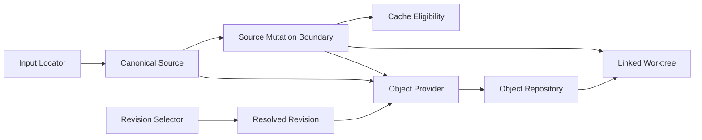

# Git source、revision 与 repository 模型

本篇定义 external、worktree 与 cache 共享的 Git 领域模型。模型只依赖 Git 可观察事实，不
依赖 doctidex root；root-scoped workflow 通过组合而不是修改这些语义。

## 1. Source identity

| 属性 | 含义与约束 |
|---|---|
| Input locator | 用户提供的 URL、SCP-like locator 或 local repository path。 |
| Public locator | 去除 credentials 后可返回给调用方的表示。 |
| Canonical source | 用于 equality、cache identity 和 mutation serialization 的规范 identity。 |
| Source kind | remote、working tree、bare gitdir、gitfile 或 managed path。 |
| Gitdir/common gitdir | Git object 与 linked worktree registration 的事实来源。 |
| Host relation | `host_repository`、`other` 或 `unknown`；只描述 source 与 owner host Git 的关系。 |

Credential-bearing locator 只能进入调用期 Git transport，不能出现在 public result、manifest、
runtime、diagnostic 或 cache identity。Canonicalization 必须保持不同 repository 不被错误合并，
同时让等价 local/file/remote locator 在已定义范围内稳定比较。

Canonical source 按 locator kind 形成稳定比较 identity：

| Locator kind | Canonicalization |
|---|---|
| Local path | 以调用 cwd 解释相对路径并形成稳定 absolute normalized path。 |
| `file:` URL | 可映射为 local path 的形式复用 local identity；其他形式保持 URL identity。 |
| Scheme URL | 去除 credentials 与 fragment，规范 scheme/host 和无意义末尾分隔，同时保留会区分 repository locator 的其余部分。 |
| SCP-like | 保留 user/host/path spelling，只移除末尾 `/`；不得与 scheme URL 自动合并。 |

不同 transport、host alias 或 repository path 保持不同 identity；doctidex-git 不通过联网猜测
它们是否指向同一 repository。Public locator 使用同一 credentials/fragment 清理原则，但可以
保留不影响 secrecy 的输入 spelling。无法可靠解释或会泄漏 credentials 的 locator 返回
`source_invalid`。相对 local path 在调用 cwd 下固定；要求 cwd-independent identity 的 operation
可以进一步限制为 absolute input。Cache source ID 只是 canonical source 的 opaque projection，
具体 hash 与长度属于 Impls。

## 2. RevisionSelector 与 exact commit

Revision Request 是 explicit `RevisionSelector` 或省略 selector 的 default intent。
RevisionSelector 具有 `kind`（commit/tag/branch）和 normalized `value`。Resolved Revision 还具有
exact commit、可选 default branch provenance、object availability 和实际 network effect。

- commit selector 规范化为完整 object ID；tag/branch 保留用户 selector 值。
- 省略 selector 时只在首次 resolution 查询 default branch，并把结果固定为 commit selector
  加 default-branch provenance。
- 后续省略 selector 时优先复用先前由 default intent 创建的 install，不重新读取 moving HEAD；
  未命中才查询 default branch 并固定 commit。实现保存 default provenance 以支持该 lookup。
- tag/branch 是 selection intent，不是后续读取指针；已创建 install/worktree 永远读取 exact
  commit。
- selector intent 与 resolved commit 分离；Install 的稳定 key 至少包含 owner、source 与已固定
  selector。Default provenance 是否形成额外 key 维度由 Impls 明确，不改变 fixed snapshot 语义。
- object 必须是完整 commit 且其 tree 可读；shallow/missing object 不得冒充 resolved。

## 3. Repository 与 worktree

Repository Model 区分 object repository、working tree 和 Git linked-worktree registration。
Working tree 具有 path、gitdir、common gitdir、HEAD/base commit 和 observable status；bare
repository 没有可编辑 checkout，但可以持有 objects 与 linked registrations。

Source Relation 由 Git identity 证明，不按显示名称猜测：local working tree、gitfile 或 bare
source 解析为 absolute common gitdir，与 host common gitdir 相同即 `host_repository`；remote
source 的 canonical locator 与 host `origin` 的 canonical locator 相同也为 `host_repository`；
host origin 可读但不同为 `other`；任一证明事实缺失或解析失败为 `unknown`。Unknown relationship
不能用于 destructive optimization。

Host repository 对 selected root 执行 Git 的 containing-working-tree resolution，并使用返回的
top-level 与 common gitdir；submodule/nested repository 按 Git 对该 root 的实际 resolution 成为
自己的 host，不同时向外层声明 ownership。命令失败为 `host_git_not_found`；只有 managed owner
records 同时把 path 归给多个 doctidex roots 时才是 `root_ambiguous`，不是猜测多个 Git ancestors。

## 4. Object availability 与 network

Source Object Provider 接收 canonical source 与 exact commit，返回 object repository、commit
availability、是否发生 network 和失败分类。它可以复用已证明匹配的 host/common gitdir 或
共享 bare objects；不能修改用户 branch、保存 credentials、选择 owner root 或创建 presentation。

Network 只允许出现在 operation contract 明确声明可能联网的 resolution/object acquisition
阶段。本地读取、link-parse、validation、list、close 和 cache clean 不得隐式 fetch。网络失败
保留既有 objects/worktrees，并以 `source_invalid`、revision codes，或 `source_access_failed` 加
`requires_user: repository_access|network_access` 区分 locator、revision、authentication 和
transport 问题。

## 5. Source mutation boundary

同一 canonical source 的 object update、linked worktree create/remove 与 cache cleanup 进入
同一 mutation boundary；不同 source 可并行。该边界在访问 root mutation 之前取得，并且
network preparation 不应与 root write lock 形成反向等待。

