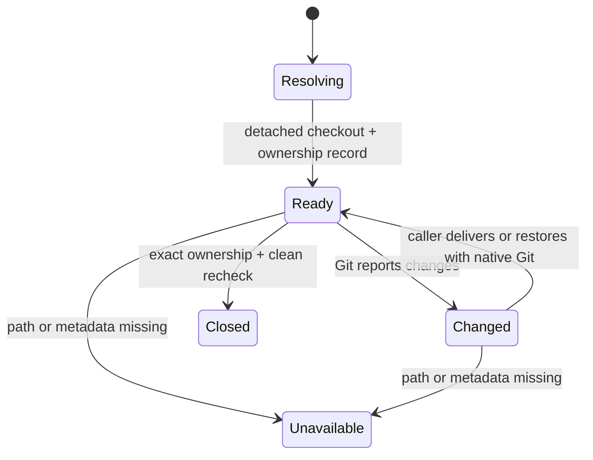

# Worktree 与 cache 模型

Worktree 为明确 revision 提供 owner-root 内隔离的可写现场；Cache 为同一 canonical source
提供共享 Git objects。两者共享 source mutation boundary，但 ownership 与生命周期不同。

## 1. WorktreeSource

WorktreeSource 具有 input、source kind、public/canonical source identity、gitdir、repository-
relative base、normalized selector 和 exact base commit。Source kind 是 managed path、URL、
working tree、bare gitdir 或 gitfile；分类决定如何证明 source identity，但不改变 worktree
最终必须是 detached exact-commit checkout 的规则。

Existing directory 可以是 Git working tree root 或其任意 repository-internal subdirectory；Git
top-level/common gitdir 形成 source identity，输入相对 top-level 的 normalized POSIX suffix 形成
repository-relative base。Managed presentation 先解析到其 underlying repository 与 suffix。Bare
gitdir/gitfile/URL 的 base 固定为 `.`。

## 2. Managed Worktree

| 属性 | 约束 |
|---|---|
| Worktree ID | owner root 内唯一 opaque internal identity；public surface 以 exact worktree path/root-internal path 标识，不要求公开 ID。 |
| Owner root | worktree record 与 internal path 的唯一 authority。 |
| Source identity/kind | 创建时证明的 source；不得由 path name 反推。 |
| Selector/base commit | 显式 selector 与创建时固定 commit。 |
| Worktree path | owner root internal namespace 的直接成员，不嵌套在 source/install 下。 |
| Gitdir | 用于 status/remove 的 Git identity。 |
| Repository-relative path | managed input 指向 source repository 子目录时保留的 base。 |
| Current state | clean、changed 或 unavailable；每次 list/close 都从 Git 重新观察。 |

`clean` 要求对该 worktree 的 `git status --porcelain` 成功且输出为空；tracked modification、
staged change、untracked path 和 Git 报告的 submodule change 都形成 `changed`，ignored path 按 Git
默认 status 规则不形成 change。命令失败、worktree path 缺失或 Git metadata 不可读形成
`unavailable`。Close 只接受重新观察后的 `clean`。

Open 不是维护前置条件；当前 working tree 可直接维护。Close 不 commit/reset/delete dirty state，
不处理 unmanaged path。Worktree 已创建但 record 尚未发布时留下 orphan evidence；归属不明时
保留，不自动 adopt 或 cleanup。

## 3. Shared Source Cache

Cache identity 只由 canonical source 决定。Cache 保存 bare objects 与 Git linked-worktree
registrations，不保存 root ownership、credentials、manifest 或 user changes。它可以同时服务
多个 owner roots，因此任何单一 root 都不能声明 cache 独占或存活性。

实现以 bare source 上成功且可完整解析的 `git worktree list --porcelain` 为分类 snapshot。Bare
repository 自身的 block 不计 linked registration；其他 block 根据是否带 Git `prunable` marker
分类：

- `valid`：Git 仍认为 worktree 有效；cache 必须保留，不检查 clean/dirty。
- `prunable`：Git 明确认为 registration 可清除；只有全部非 valid 项均为此状态才可能清理。
- `unknown`：command 失败、block 缺少 worktree identity 或 metadata 无法完整解析；这是整个
  snapshot 的保守失败，完整保留 cache 与所有 linked paths。

Cache Cleanup Eligibility 要求 valid=0、unknown=0，且其余全部 prunable。Dry-run 返回计划；
apply 在同一 source boundary 中重新分类，变化则 conflict。Cleanup 只删除所选 bare cache，
不删除 linked/root-owned path、record 或 Git index，也不联网。

Cleanup selector 可以是调用者提供的一个 canonical source，或 `--auto`。`--auto` 在本次调用开始时
扫描实现拥有的 source-cache namespace，仅把符合该 namespace 命名规则的 bare cache 作为候选；它
不从 root/runtime/manifest 反推 source 存活性，也不把未知 filesystem object 当作删除目标。每个
candidate 以 opaque cache source ID 排序，在自身 source mutation boundary 中独立重新分类和发布；
不存在跨 candidate transaction。扫描后新出现的 cache 留给下一次明确调用，已消失或损坏的 candidate
以 item-level blocked 保留，不影响其他 candidate。

## 4. 组合与并发

Worktree open/remove、source object update 与 cache clean 对同一 canonical source 串行；list 和
status 是只读观察。Worktree ownership publication 属于 root mutation，source preparation
先于 root publication。Close 先由 Git 移除 exact clean worktree，再移除 root record；若中断后
record 仍在但 path 或 Git registration 不再可验证，当前 lifecycle 将其作为 unavailable evidence
保留并报告，不自动删除 ownership record。更积极的 stale-record recovery 属于可选 variant
capability，必须先证明不会丢失仍存在的 worktree 或用户结果。
