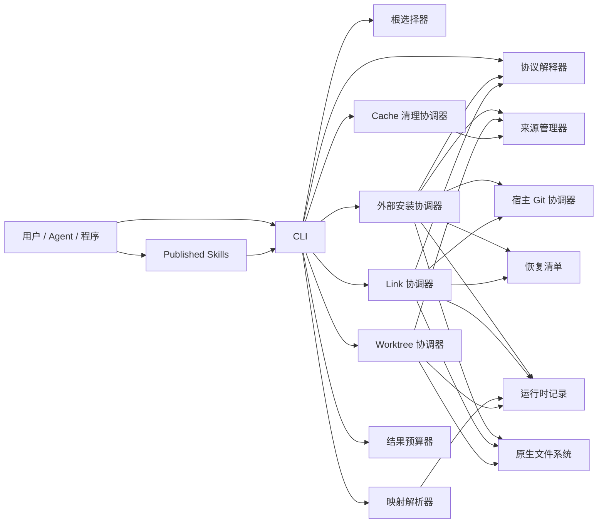
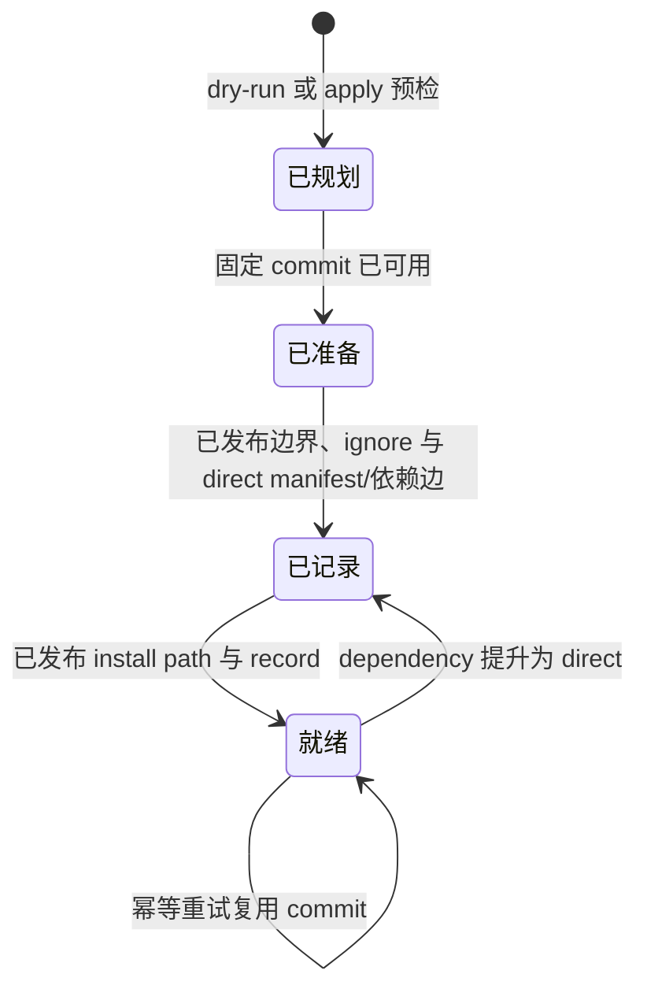
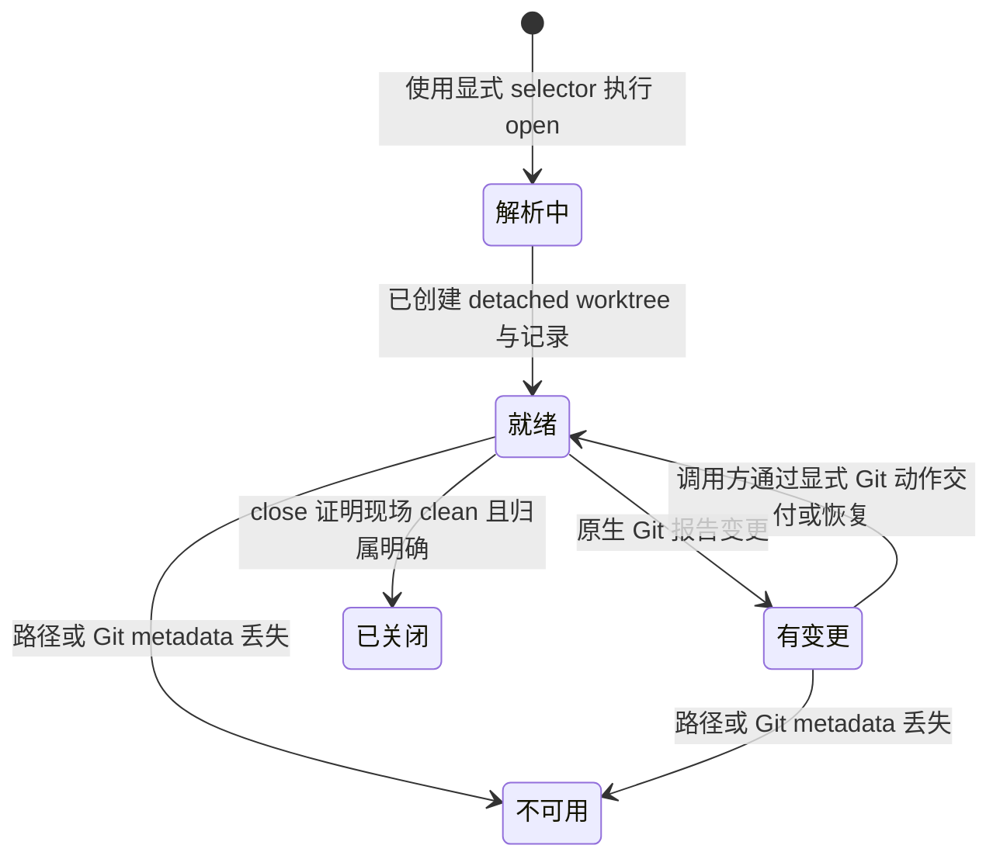

# 子系统与生命周期

本文定义语言无关的归属关系和跨子系统状态变化。当前 Python 模块映射见
[Python Details](../details/python/index.md)，实现来源见
[DX-REQ-0008.2](../../requirements/0008-doctidex-git-v1-0-0-alignment/02-python-details-and-implementation.md)。

用户如何选择操作见 [用户工作流](workflows.md)，精确命令与可观察字段见
[CLI](interfaces/cli.md) 和 [JSON Schema](interfaces/cli-schema.md)。本篇只解释这些契约背后的
职责、状态变化、并发和非原子边界，不规定 Python 模块、文件或 storage layout。

下述 external 与 worktree 子系统只负责 doctidex-git 创建或登记的对象。它们不接管原生
Git、手工 worktree、submodule、symlink 或其他工作方式，也不构成协议符合性前置条件。

## 1. 子系统职责

| 子系统 | 负责 | 不负责 |
|---|---|---|
| 表面编排器（Surface Orchestrator） | 参数、root/source 选择、validation scope 与 restore filter 规范化、dry-run/apply、result、分页、渲染和退出码。 | 协议语义、内容写作、Git 交付。 |
| 协议解释器（Protocol Interpreter） | UTF-8 Markdown/frontmatter、root、最近负责制、局部配置、link、可达性、scope 支持闭包和确定性 validation。 | Git source、registry、权限和语义结论。 |
| 根选择器（Root Selector） | cwd/显式路径的候选发现与歧义结果。 | 持久 session 或自动采用最近根。 |
| 来源管理器（Source Manager） | 不含凭据的 source identity、objects、selector 解析和 commit 可用性。 | host frontmatter、presentation path、用户 branch。 |
| 外部安装协调器（External Install Coordinator） | root/source/selector install identity、direct/dependency role、扁平依赖图、逻辑只读发布和 restore。 | 用户 target、递归读取依赖文档、自动跟踪 remote、修改 source 内容。 |
| 宿主 Git 协调器（Host Git Coordinator） | 识别唯一宿主 repository、精确 payload ignore、manifest/link 可追踪性和 tracked-state 检查。 | stage、commit、`git rm --cached` 或改写无关 ignore 规则。 |
| Link 协调器（Link Coordinator） | 相对 symlink、safe 分类、frontmatter、repository-relative mapping 和 manifest link record。 | 绝对 symlink、目录复制、生成正文或修改 install 内容。 |
| 恢复清单（Recovery Manifest） | 保存 portable install/link facts、schema 与稳定 identity。 | credentials、宿主绝对路径、运行期 cache/lock 或 Git index 状态。 |
| 映射解析器（Mapping Resolver） | 从目录或 symlink 恢复 current-owner/installed-repository mapping、owner/content root、target state、source/commit 和 repository-relative path。 | validation、network、自动安装、递归 restore 或 authorization。 |
| Worktree 协调器（Worktree Coordinator） | owner root 选择、root-internal detached open、有界 list、status 和 clean close。 | 强制创建现场、自动复用、branch/commit/push/merge、清理手工 worktree。 |
| Cache 清理协调器（Cache Cleanup Coordinator） | 按 source identity 串行检查 Git worktree registrations、报告 counts，并只删除符合资格的单个 bare cache。 | root 选择、批量清理、隐式回收、修复 Git metadata，或删除任何 linked/root-owned path 和 record。 |
| 结果预算器（Result Budgeter） | 确定性顺序、limit、计数和 opaque cursor。 | 内容摘要、隐藏 total 或改变 domain operation。 |
| 运行时记录（Runtime Records） | 最小 install/link/worktree 归属信息和 diagnostic identity。 | 替代恢复清单、协议事实、agent 计划或 credentials。 |

依赖方向：协议解释器不依赖 Git；来源管理器不依赖 doctidex root；外部安装协调器组合
source、宿主 Git、清单与协议事实；Link 协调器依赖完整 install mapping；映射解析器和
Worktree 协调器只读取所需的最小记录；表面编排器不能重新实现领域规则。



## 2. 根选择生命周期

1. 解析特定于 operation 的 cwd、ROOT 和 target。
2. 显式 ROOT 必须自身是 root；省略时收集包含 cwd/target 的候选。
3. 零候选为 not found，多候选为 ambiguous，单候选成为 selected root。
4. 验证 selected root 包含 operation target；否则返回 mismatch。
5. 把 selected root 写入 result，不保存为下一次调用的默认值。

## 3. 外部安装生命周期



### 3.1 规划

选择 root 与唯一 host Git repository，清理 source identity，把 selector 规范化后形成
root/source/selector install key，并分配或复用稳定 ID/path。若指定 dependency parent，验证
其属于同 root 且完整；随后解析或复用 commit，验证 payload 未被追踪、精确 ignore 规则
不会覆盖 manifest/link，并计算 role、parent edge、frontmatter 与 planned paths。dry-run
到此结束且不持久化。

### 3.2 应用

1. 在不持有 root 变更归属权时取得所需 Git objects，并准备 fixed-commit 读取状态。
2. 重新验证 install path、host Git 状态、manifest 和 responsible index 未偏离 plan；偏离
   则 conflict，不覆盖并发修改。
3. 串行发布内部命名空间 frontmatter 与精确 `.gitignore` 规则；direct 写 portable manifest，
   dependency-only 只写运行期 parent edge；不触碰正文。
4. 发布 install path 和完整 record；link-parse 对可识别但不完整的受管身份仍返回 managed，
   并以 unavailable 与 finding 区分损坏状态。
5. 返回实际 changed、manifest Git 状态、network 与未完成的后续动作。

frontmatter、ignore、manifest、install path 与 record 不构成事务。发布次序优先保证 install
出现前已有协议边界与恢复信息；任一步失败都保留已完成事实并给出幂等重试动作。

### 3.3 环状关系与提升

依赖图只由显式 `--dependency-of` 调用逐边建立。命中既有 install key 时复用节点并停止，
self edge 或回到祖先不会触发递归。dependency-only 节点收到普通 install 请求时，在原
ID/path 写入 manifest 并提升为 direct；direct 节点后续新增 parent edge 时仍保持 direct。
不同 selector 永远创建不同 key，不因 commit 相同或 object store 可共享而折叠。

## 4. 外部链接生命周期

1. 以 source root 规则解析最内层完整 mapping 和 input suffix。
2. 组合 repository-relative base/suffix并确认不越 repository。
3. 判断 source directory 是否能作为完整 doctidex 根通过 validation：能则计算为 safe，
   否则按 unsafe 接入；随后确认相对 symlink 可创建且 target 不被宿主 Git ignore。
4. dry-run 返回 plan；apply 重新验证 source/target 未变化。
5. 串行发布 target frontmatter、相对 symlink、mapping 和 manifest link record；不 stage。

source mapping 损坏、target overlap、symlink 不支持、Git ignore 冲突或并发变化在发布前 blocked。同 target/同 mapping 重试
进入 Ready，无 replace 状态。

## 5. 外部恢复生命周期

```text
选择 root 与 host Git
  -> 验证恢复清单 schema/identity
  -> 规范化 install filter 并分页
  -> 对每项读取 exact source/commit/path
  -> 检查现有载荷与 Git 排除边界
  -> dry-run 报计划，或 apply 重建缺失 install
  -> 分别返回 planned、restored、unchanged 或 blocked
```

恢复不读取 remote HEAD 或移动 ref；只有 exact commit 对象不足时才按记录 source 联网获取。
单项以 install ID 串行，独立项可继续；清单在处理期间改变则停止使用旧 cursor/plan。恢复
按清单重建必要的内部 install/link records，但不修改清单、frontmatter、Git index 或既有
link。manifest 不包含 dependency-only 节点或 dependency edges；stable install path 重新
出现后，既有 relative symlink 无需变更即可恢复。

## 6. 映射解析生命周期

```text
输入目录或 symlink PATH
  -> 按路径自身识别 directory/symlink，不要求 symlink target 存在
  -> 从外层受管 presentation 恢复 owner root
  -> 识别 PATH 所在 content root
  -> 优先解析 owner-root current mapping
  -> 若 PATH 是 install 内 external symlink，读取 content root 的 portable manifest/link record
  -> 以 current parent edge、source 与 exact commit 查找 owner root 中的 target install
  -> 组合 repository-relative base 与词法 suffix
  -> 返回 available、合法未展开、可恢复缺失、damaged 或 unmanaged
```

主仓库 current-owner link 指向缺失 install path 时返回 `owner_install_missing`；restore 仍由
外层工作流显式执行。install 内 portable link 的 target 不存在时，只要 manifest、symlink
target、source/selector/commit 和 repository-relative base 一致，就返回正常
`dependency_not_installed`，并公开当前 outer parent install ID；不在只读 install 内 restore。

owner root 已有由当前 parent edge 指向、且 source 与 exact commit 匹配的 dependency install
时，解析器忽略 install 内 broken 物理 target，改从外层 install 组合 working path。只有
portable/current record 不能自洽、
路径越 repository 或所需外层 ownership 不可证明时才返回 damaged。整个过程不写记录、
不改 symlink、不联网、不运行 validation，也不自动安装依赖。

## 7. 受管 Worktree 生命周期



- 解析失败不会留下 ready 记录，并保留所有既有 root。
- 所有 source kind 先选择 owner root；managed source 从 mapping 选择，其他 source 从
  `--root` 或 cwd 选择。
- open path 始终是 owner root 的 `/.doctidex` 直接子命名空间成员，不以 SOURCE 所在 install
  或 worktree 为父级；payload 被宿主 Git ignore，不写 external manifest。
- list 根据当前 Git 事实推导 clean/changed；不能只凭 record 声称 clean。
- unavailable 现场保留用于诊断，并阻止 close。
- close 验证精确归属、重新检查 Git status，只移除 clean worktree，随后移除 record。
- worktree 创建与 record 发布之间发生中断时，现场成为可恢复的孤立证据，而不是自动删除的
  目录；Details 必须定义无需破坏性猜测的发现方式。

## 8. 共享来源 Cache 清理生命周期

1. 清理 sanitized URL 并解析 canonical source identity；未命中对应 bare cache 时返回
   `cache_source_not_found`，不创建 cache，也不访问 network。
2. 进入该 source 的 mutation boundary，确保与 object update、install/worktree create、
   worktree remove 和同 source cleanup 串行；整个 operation 不取得 root mutation boundary。
3. 从 bare repository 的 Git worktree metadata 枚举全部 linked registrations；bare source
   repository 自身不计入，并以 Git 规则把每个 linked registration 分为 valid 或 prunable。
   metadata 缺失/损坏或任一项无法分类时 blocked，完整保留 cache 和所有 linked paths。
4. 有任何 valid worktree 时返回 `preserved` warning；不检查或使用 clean/dirty、runtime
   ownership、manifest inclusion 或文件系统路径缺失来弱化该结论。
5. valid 为零且其余登记全部 prunable 时，dry-run 返回 `planned`，不写持久状态。
6. apply 在同一 mutation boundary 内再次读取和分类 metadata；状态发生变化时返回
   `cache_cleanup_conflict` 并保留。资格仍成立时只删除所选 bare cache，返回 `removed`。

删除 cache 与未来按其他 operation 网络契约重新取得 objects 不是一个事务。清理从不修改
root-owned install/worktree payload、恢复清单、runtime records 或 Git index，也不由 close、
restore 或其他生命周期调用。

## 9. 校验生命周期

1. 在不依赖 Git 或 registry 的情况下选择 root；把请求的 scopes 规范化为标准集合，全根
   coverage 则使用 `/`。
2. 解析该 coverage 所需的 root 以及 safe index/log 层级。
3. 按最近负责制规范化局部配置，并构造 scope 支持闭包。
4. 构建校验所选路径、必需可达性和 link 注释所需的有界、无循环 Markdown 路径图；scope
   不得抑制必要的范围外读取。
5. 记录确定性 findings，并分离 semantic candidates；随后只保留 scope 内事项，以及直接
   阻止该 scope 校验的支持路径失败。
6. 根据完整领域结果设置 full/scoped coverage 与 pass/fail，完成排序后再应用输出分页，
   不改变 pass/fail 或 total。

Cursor continuation 可以重新扫描或使用内部稳定快照，但可观察顺序和 total 必须对应同一
root 状态和标准 scope 集合。root 内容发生变化、无法保持连续结果一致时，返回
`cursor_invalid`，不得混合不同状态。root 选择或 scope 校验失败属于 blocked；必需的 safe
路径不可读会产生 protocol fail 和 `scan_complete: false`。

## 10. 并发

- 同一 canonical source 的 object 更新、worktree 变更和 cache cleanup 必须串行；cleanup
  不等待 network，也不取得 root 变更边界。
- 同一 install key 的 role/parent 变更必须串行；不同 selector key 可以共享只读 objects，
  不能共享 install path。
- 同一 doctidex root 的 frontmatter/install/link/manifest/ignore 变更必须串行。
- network/source 准备必须在进入 root 变更边界前完成；任何 operation 都不能在等待网络时
  持有 root 变更边界。
- operation 同时需要 source 与 root 状态时，先准备 source，再验证 root plan 并发布；
  这是全局资源获取顺序。
- 相互独立的 sources 和 roots 可以并发处理。
- Worktree path 和 managed identity 必须唯一；并发 open 调用绝不共享一个可写目录。
- CLI 检测 dry-run/preflight 后发生的 index/manifest/mapping/Git tracking 变化，并返回 conflict，而不是覆盖。

Agent 层并行编辑不受 CLI 锁保护。协调 agent 必须串行处理同一 root 上相互冲突的工作包，
或者给出互不重叠的归属范围与集成顺序。

## 11. 非原子边界

Git object 获取、worktree 创建、frontmatter 写入、`.gitignore` 更新、manifest 写入、install
发布、symlink/mapping 写入和 agent 编写的 link/正文是彼此独立的效果，不存在跨文件系统
或跨 repository 的事务。因此每个
变更结果都必须说明：

1. 哪些效果已经完成；
2. 哪些旧结果仍可读取；
3. 哪些 path/record 处于部分完成或损坏状态；
4. 最小安全重试动作或所需用户决定；
5. 另一个 root 的结果是否独立且已保留。

实现清理只能移除归属可证明、且用户可见结果不是 dirty 的资源。shared bare source cache
还必须满足第 8 节更严格的 Git worktree eligibility；归属或分类不确定的 artifact 必须保留
并报告。
