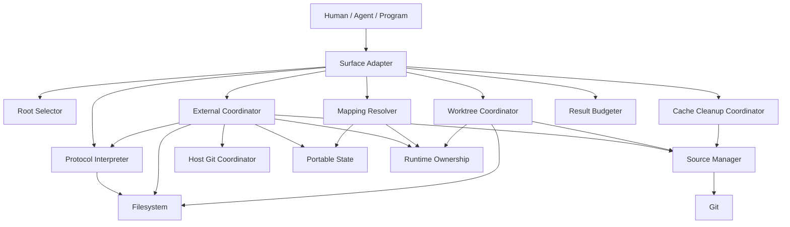

# 组件、责任与依赖

本篇把 [Architecture models](../index.md#模型层) 组合成语言无关系统。组件是责任边界，不是
Python module；不同 Impls 可以改变进程、package 或 service topology，但必须保持依赖方向
与可观察语义。

## 1. Component graph

依赖图无环。Protocol Interpreter 不依赖 Git；Source Manager 不依赖 root；Result Budgeter 不
产生领域事实；Surface Adapter 不得重写 coordinator 的状态机。

## 2. 组件契约

| 组件 | 输入 | 产出 | 非责任 |
|---|---|---|---|
| Surface Adapter | command context、public inputs | normalized request、result presentation、exit code | domain rules、内容写作、Git delivery。 |
| Root Selector | explicit/default/target path | 唯一 RootContext 或 candidates failure | session、source identity。 |
| Protocol Interpreter | root、scopes、documents | tree/config facts、reachability、validation result | Git/managed state、语义结论。 |
| Source Manager | locator、selector、exact commit | canonical source、resolved revision、objects、source relation | owner root、presentation、credentials persistence。 |
| Host Git Coordinator | owner root、planned paths | unique host repo、tracking/ignore facts | stage/commit/reset、root selection。 |
| External Coordinator | owner/source/install/link/recovery models | install/link/restore plans 与 publication | 自动递归依赖、moving-ref refresh。 |
| Mapping Resolver | input path、runtime/portable state | owner/content/source/repository mapping | network、write、validation、authorization。 |
| Worktree Coordinator | owner root、source、selector | managed writable worktree lifecycle | branch/delivery、dirty cleanup。 |
| Cache Cleanup Coordinator | canonical source | Git-derived eligibility 与单 source cleanup | root selection、batch/implicit cleanup。 |
| Portable State | direct installs、durable links | versioned recovery identity | runtime edges、host paths、locks。 |
| Runtime Ownership | installs、links、worktrees | current ownership/mapping evidence | protocol facts、public API。 |
| Result Budgeter | complete domain collections、query state | deterministic bounded pages/cursor | filtering semantics、AI summary。 |

## 3. State ownership

| State | Owner | Readers | Mutation boundary |
|---|---|---|---|
| Markdown/frontmatter | responsible index / user repository | Protocol Interpreter、External Coordinator | owner root publication。 |
| Host Git ignore/tracking | host Git repository | Host Git Coordinator | owner root publication + native Git decisions。 |
| Portable manifest | owner root/version control | External/Mapping | owner root publication。 |
| Runtime ownership | owner root | External/Mapping/Worktree | owner root publication。 |
| Source objects/registrations | canonical source object provider | External/Worktree/Cache | source mutation。 |
| Install payload | owner root + exact source commit | native readers、Mapping | source then root publication。 |
| Maintenance worktree | owner root ownership + Git | user/agent/native Git | source then root publication。 |

一个 state 只能有一个 mutation owner。Reader 可以组合多个 owner 的 facts，但不能将缓存结果
反写成另一 authority 的状态。

## 4. 全局依赖约束

1. Public surface 依赖 model/workflow，不复制其定义。
2. Root selection 在 root-scoped domain mutation 前完成；cache clean 不选择 root。
3. Source preparation 先于 root publication；network 不在 root lock 内等待。
4. Portable state 只保存跨 clone 所需 facts；runtime state 只保存当前 host ownership。
5. Mapping 只读，不能以“修复方便”为由获得 write authority。
6. 每个 destructive action 必须由 exact ownership 与当前 observable state 同时证明。

