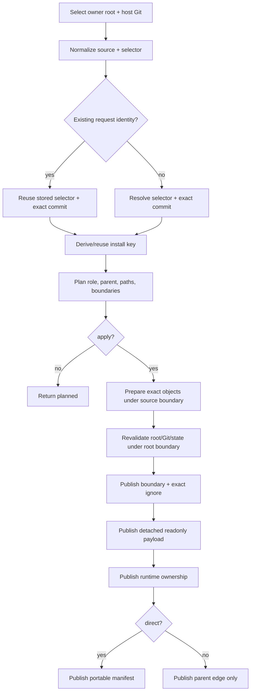
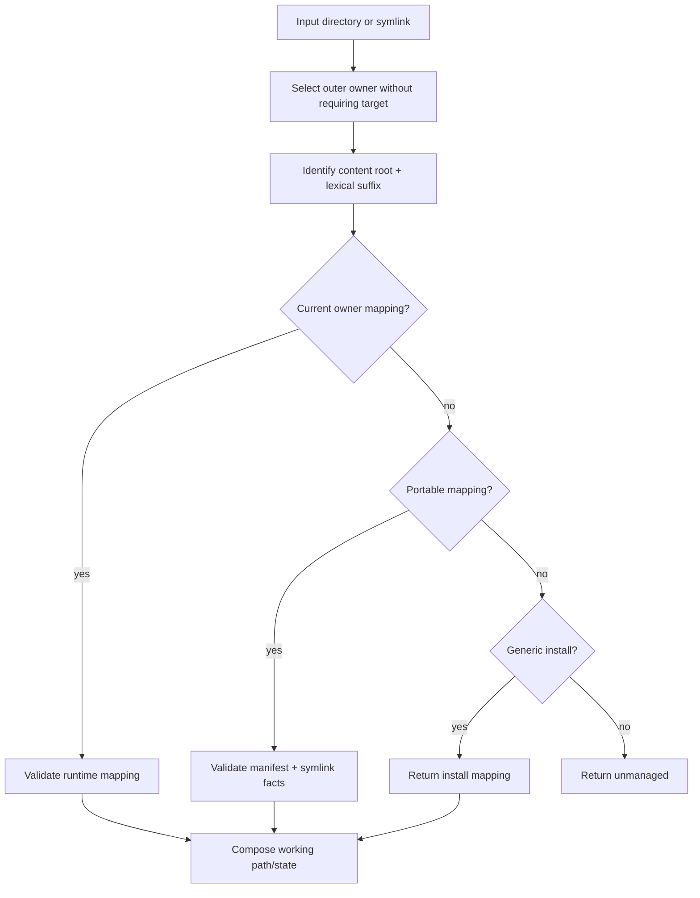

# External workflows

External workflows 把固定 Git snapshot 安装到 owner root、建立 durable presentation、按版本化
state 恢复，并离线解释 managed path。它们消费
[external model](../models/external-installation-and-mapping.md)，不自动发现或递归安装依赖。

## 1. Install

### 场景与结果

调用方需要一个不被 host Git 追踪、位置稳定且可恢复的 external repository snapshot。默认
dry-run 返回 source/selector/commit、role、planned path、Git boundary 与 network plan；apply
发布 fixed install。Direct install 进入 manifest；dependency install 只进入 runtime parent edge。

### Flow



显式 selector 或 default intent 的 existing lookup 发生在 resolution 前；新 install
在 selector resolution 后形成 key。Moving ref 只影响首次 resolution；idempotent retry 复用固定
commit。Parent 必须属于同 owner root；self/cycle 命中 existing key 后结束。Promotion 在原
identity 上把 dependency 变为 direct，不改变 path/commit。

Host layout publication 对 owner root index 确保 `.doctidex/git/installs` 同时出现在
`doctidex.boundary-set` 与 `doctidex.unsafe`，不删除其他 entry。Host `.gitignore` 只追加下列
root-relative anchored entries；令 `base` 在 selected root 等于 Git top-level 时为 `/`，否则为
`/<root-relative-posix-path>/`：

```text
{base}.doctidex/git/installs/
{base}.doctidex/git/worktrees/
{base}.doctidex/git/runtime.json
{base}.doctidex/git/.mutation.lock/
```

已有完全相同行幂等保留；不同或更宽 ignore pattern 不被静默改写。`manifest.json` 不得被
ignore，payload 不得已有 tracked entries。

## 2. Link

Link 从 complete direct install 或其既有 mapping 选择 source directory。Plan 依次证明：source
repository suffix、target normalization/occupancy、responsible index、host tracking/ignore、safe
state、relative symlink capability 与 manifest trackability。

Apply 在 root boundary 内重查这些 facts，再发布 boundary/frontmatter、relative symlink、runtime
mapping 与 portable manifest。具体顺序由 Impls 选择并说明；中断可能留下 presentation/record
不一致，但后续读取必须把它识别为 damaged 或 incomplete、保留现场并允许同 mapping 有限重试。
同 target/same mapping 幂等；different mapping 不 replace。Link 不 stage/commit，也不生成
Markdown prose。

Link 对 target 的 responsible index 确保 target path 位于 `boundary-set`；safe state 为 unsafe 时
同时确保 `unsafe`，为 safe 时移除该 exact unsafe entry，不改变其他配置。结构化配置不等于
navigation：调用方仍须用 native edit 在该 responsible index 或其他可达文档中加入语义 Markdown
link；该编辑属于 human/agent workflow，后续 validation 按 reachability 报告客观结果，不要求
CLI 在 link result 中重复通用写作提示。

## 3. Restore

Restore 读取并验证 portable manifest identity，规范化可选 install filters 后形成按 install ID
排序的稳定 selection。Pagination 先从该 selection 选出当前页，dry-run/apply 都只观察和处理
当前页；下一页不得因前页 payload 被恢复而被隐式执行或跳过。每项只使用 manifest exact
source/selector/commit/path：

1. existing complete payload -> unchanged；
2. missing payload + objects available/acquirable -> planned/restored；
3. damaged/path conflict、manifest damage 或 exact commit unavailable -> item blocked；
4. independent items 继续，所有结果进入同一 bounded collection。

Restore cursor 的 observed identity 是 manifest identity 加 normalized filter/install-ID selection，
不是每项当前 payload state；manifest/filter 不变时，前页恢复不会令下一 cursor invalid。每页
item state 按该 invocation 重新观察，`changed` 只列本页实际恢复的 payload。

Restore 不读取 remote HEAD、不刷新 selector、不改 manifest/frontmatter/symlink/Git index。它可以
重建必要 runtime ownership；dependency-only 不在 manifest 中，因此不由 restore 创建。

## 4. Remove

Remove 解决的场景是 owner root 中已不再需要的 managed install。调用者传入单个 Install ID；若只有
presentation path，先用 `external link-parse` 取得 current `install_id`。它不会从 source URL、selector
或任意目录猜测 target，也不批量处理 install。

Plan 首先证明 selected root 的 runtime record、stable install path 和 role 可解释；然后使用 shared
tree observations 扫描 safe Markdown 与 filesystem symlink，并读取 runtime/portable mapping 与 parent
edges。install payload、boundary-set 和 unsafe 内部不递归扫描。任一 reference、damaged ownership、
unknown ID 或 revalidation conflict 都 blocked，保留全部 state；`affected` 和 external finding 给出
document/symlink/managed-record evidence 与下一步。

dry-run 完成相同 preflight 并回显 planned effects，但不修改持久 state。apply 在 source -> root
mutation order 下重查所有 safety facts；只在 reference-free 时移除 exact Git worktree payload，随后
删除 per-install runtime record，direct install 再删除 portable manifest record。它不改写 Markdown、
symlink、frontmatter、ignore 或 shared source cache，也不隐式运行 cache clean。物理 payload 已移除、
metadata 尚未发布的 interruption 保留可诊断 ownership；以相同 ID 重试只补齐已确认的删除。

hidden dependency 是 remove 的例外：它没有可安全删除的 current presentation。remove 对该 exact ID
完成 `preserved_hidden` no-op，保留 physical payload、runtime record、parent edges、manifest、links、
cache 和 host Git，不扫描 reference，也不要求先解除 hidden。

## 5. Link parse



Available path 返回 working path。Current direct install missing 返回 recoverable owner-install
state。Portable dependency target missing 但 records 自洽时返回 exact dependency facts 与 outer
parent，不视为 damaged；调用方决定是否扁平 install。Mapping resolver 不写、不联网、不
validation，也不在 readonly install 内 restore。

## 6. Checkout hook reconciliation

`hook --install` 解决 host Git checkout 不会同步 ignored install payload/runtime 的问题。它选择一个
owner root 和其唯一 host repository，安装该 root 的 `post-checkout` entrypoint。重复安装相同 entrypoint
为 unchanged；已有非产品 hook 是 blocked conflict，保持其内容。安装不配置 global hook、不改变 Git
config、index、manifest 或普通文件。

`hook --run` 在 post-checkout 后离线执行。它先读取 current portable manifest 和 runtime，逐项处理
manifest 中 payload 存在的 direct installs：exact `resolved_commit` 是 hard target；selector/default
branch 及其他 revision provenance 只按 manifest 做 best-effort runtime alignment。dirty、damaged、
objects 缺失或无法同步 metadata 的项保留现场，并提供 item result；run 不 fetch、也不以 moving ref
重新解释 manifest。

完成的 direct install 是 dependency forest roots。对每条 runtime parent edge，hook 在 parent payload
自身作为 doctidex root 且拥有合法 manifest 时查找 child metadata。找到 metadata 的 child 按同一
revision contract 处理并继续遍历；没有 metadata、不是 doctidex root 或清单损坏时，将该 child 及其
descendants hidden。每个 existing hidden node 也在每次 run 进入重新判定：没有可达 aligned direct
ancestor 时明确保持 hidden，重新获得 metadata 时只 unhide 该 node，descendants 各自重新判定。

run 在 source -> root mutation order 下对 worktree switch、hidden path move 和 runtime mutation 重查
current facts。每项的成功、忽略、hidden、unhidden 或 blocked 独立，不能因另一项 warning 回滚；hook
只能报告 warning，Git checkout 本身不回滚。portable manifest、durable symlink、Markdown/frontmatter、
`.gitignore`、Git index 和 shared cache 均不属于 run effect。

## 7. Failure 与 partial publication

Source locator 使用 `source_invalid`，revision 使用 revision codes；authentication 与 transport
均使用 `source_access_failed`，分别以 `requires_user: repository_access` 与 `network_access`
区分。Root/host Git、tracking/ignore、target conflict、symlink capability、manifest/runtime
damage 和 concurrent revalidation failure 保持各自 stable codes。任何 failure 保留 existing
install/link/manifest；可可靠确定的已发布部分进入 changed，其他情况用 affected/result 引导
重新观察，retry 只补齐同 identity。需要 stage、删除 tracked payload、覆盖 target 或修复 versioned state
时升级给用户。
