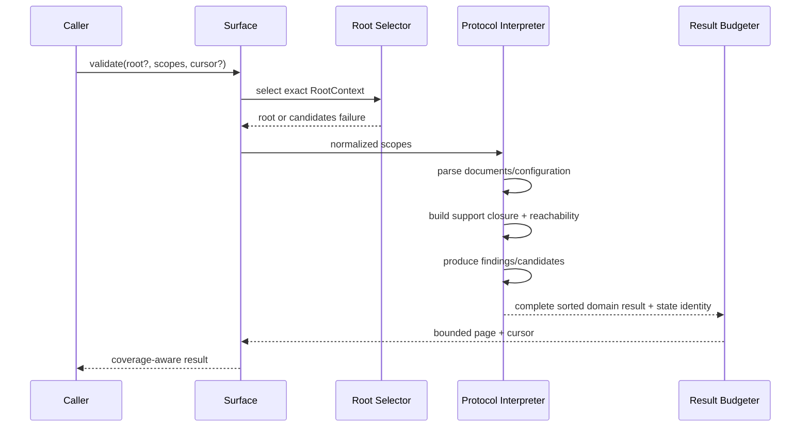

# Validation workflow

Validation 把 [tree/configuration 模型](../models/doctidex-tree-and-configuration.md)转换为确定性结构
结论。它离线、只读，不依赖 Git、external registry 或 Published Skill readiness。Protocol rule
本身以 [`spec/overview.md`](../../../../spec/overview.md) 为本 Architecture 显式 normative
dependency；实现必须逐条落实其 validation criteria，本篇只定义 doctidex-git 的 processing、
scope、result 与 pagination contract，不复制另一份协议。

## 1. 用户画面

Human/agent 需要判断完整 root 或一组关注目录是否满足 protocol structure，同时把需要阅读的
semantic candidates 留给后续判断。Program 需要稳定、可分页的 finding 集合。调用方选择
exact root 与 scopes；工具不把局部 pass 提升为全根结论。

## 2. Sequence

## 3. Processing stages

1. **Select**：明确有效 root；显式或自动选择都必须形成 `RootContext`，否则 selection blocked。
   任一 scope 规范化为 root-internal directory，非法输入整体 blocked。
2. **Discover**：读取 root index、scope directories 与建立解释所需 support paths。
3. **Parse**：解析 UTF-8/frontmatter/Markdown；产生 document/config/link facts，具体 parser
   profile 与辅助对象由 Impls 定义。这些 tree observations 也可被 external remove 的只读
   reference preflight 消费；复用 observations 不使 remove 成为 validation，也不把 remove 的
   target/exclusion policy 反向加入本 workflow。
4. **Resolve**：应用最近负责制，构造 boundary、atomic、unsafe 与 responsible-index mapping。
5. **Graph**：建立所需 reachability 和 link-annotation edges，检测不可达、越界与结构冲突。
6. **Classify**：protocol findings 与 semantic candidates 分离；不可读 safe path 同时影响
   `scan_complete`。
7. **Scope**：只保留 scope 内事项和直接阻止该 scope 的 support failure。
8. **Page**：对完整、确定性排序后的集合分页；pagination 不改变 totals 或 pass/fail。

### 3.1 Finding emission

Finding 对应一个可客观定位的 protocol violation。相同 finding 去重；前置 fact 不可用时不为
无法继续证明的派生检查追加猜测性 finding，与失败 fact 无关且仍可证明的问题继续报告。具体
scanner control flow、suppression table 和 parser exception mapping 属于 Impls；公共要求是 code、
path 与恢复动作稳定且不误导调用方。

### 3.2 Semantic candidate emission

Candidate 是确定性 review queue，不由 AI 或文本质量评分生成。实现以客观 trigger 提示需要
语义阅读的 index description 或 unsafe scope；结构无法解析时优先返回 finding。Trigger 的具体
充分条件属于 Impls，但同一 coverage/state 下必须稳定、可定位，且不能把 candidate 当成
protocol defect。

Scoped 结果只包含 scope 内 responsible index/unsafe target 的 candidates；仅作为范围外 support
prefix 读取的 index 不产生 candidate。Candidate 只提示 human/agent 检查说明是否充分、unsafe
范围是否足够紧，不预判协议 defect。

## 4. Result invariants

| Result property | 不变量 |
|---|---|
| coverage/scopes | `full` 只对应 `/`；否则为 normalized scoped set。 |
| protocol structure | 只由机械 protocol findings 决定。 |
| scan complete | 所需 paths 是否全部成功读取，与 findings 有无独立。 |
| semantic review | candidates 是否仍需 human/agent 判断；不改变 protocol conclusion。 |
| findings/candidates | domain 分离、稳定排序、完整 totals。 |
| cursor | 绑定 root/scopes/filter 与实现可观察 state；检测到不匹配时 invalid。 |

Validation 不判断内容可信、相关、是否应修改、Git 是否 clean、external 是否 managed 或用户是否
授权维护。未受管 symlink/submodule 不是 readiness failure；只按其最终可观察 tree 解释。

## 5. Failure 与下一步

Root/scopes 错误不写入，调用方以 exact input 重试。Document/config/link error 作为 finding
保留其他扫描结果。必要 safe path 不可读时 `scan_complete: false`，修复访问或结构后重跑。
Cursor invalid 时从第一页重新扫描；不得混合不同 tree state。
