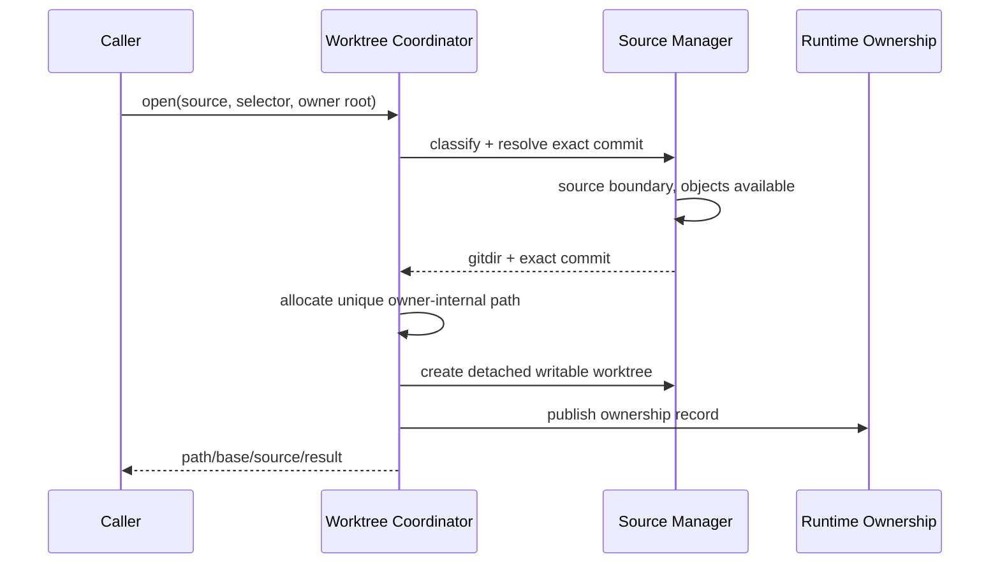

# Worktree 与 cache workflows

Worktree workflow 为显式 revision 提供可写隔离现场；cache workflow 为 human/program operator
显式清理一个 source object store。它们共享
[worktree/cache model](../models/worktree-and-cache.md)，但 cache clean 不选择 root，也不由
Published Skills 隐式调用。

## 1. Worktree open

调用方在当前 working tree 不适合直接维护时，提供 source 与明确 commit/tag/branch。Source
可以是 managed path、Git working tree 内任意目录、bare gitdir、gitfile 或 URL；owner root 从 source mapping、
explicit root 或 cwd 选择，不能把 source/install 本身当成 owner。



Worktree path 是 owner root internal namespace 的直接成员。Open 不创建 branch、不修改 source
内容、不递归嵌套。Create 成功但 record publication 中断时保留 orphan evidence并报告，不能
猜测删除。

## 2. Worktree list

List 从 selected owner root 的 records 得到候选，再对每项用 Git facts 重观察 path/gitdir/status。
返回 clean、changed 或 unavailable；record 不能单独证明 clean。Source/worktree filter 在分页前
应用，集合稳定排序并绑定 observed state。List 不修改 record、fetch 或 cleanup。

## 3. Worktree close

Close 由 input path 反查唯一 owner，验证 exact record、path、gitdir 与 source identity，然后
重新运行 Git status：

- clean + ownership complete：Git remove exact worktree，成功后删除 record；
- changed：blocked，完整保留，由调用方用 native Git 决定 commit/reset/delivery；
- path 与 exact Git registration 均 absent、record 自洽：删除 stale ownership record，完成中断恢复；
- 其他 unavailable/damaged：保留 evidence，先诊断；
- unmanaged/ambiguous：不操作，要求 exact owner 或改用 native Git。

Close 不隐式 cache clean，也不因 record 存在删除 identity 不明的 filesystem directory。Created-
without-record orphan 不属于任何 public owner record；CLI 只报告诊断，operator 使用返回的 path/
gitdir facts 和 native `git worktree` 检查，Architecture 不授权自动 adopt/delete。

Stale-owned recovery 成功时 status 为 `ok`，返回关闭前 `unavailable` item，result 明确 ownership
record 已清除；因为 invocation 没有创建、修改或删除 public worktree path，`changed` 为空。普通
clean close 才把实际移除的 worktree path 放入 `changed`。

## 4. Cache clean

Human/program 可以提供 source URL，或以 `--auto` 枚举 implementation-owned source-cache namespace。
URL 先得到 canonical identity；cache 不存在时返回 not found，不能创建或联网。Auto 不从 root records
或 cache path 反向恢复 URL，只按 opaque source ID 稳定排序 recognized cache candidate。Coordinator 在每个
source mutation boundary 内读取 Git linked registrations，分类 valid/prunable/unknown：

```text
any unknown -> blocked, preserve all
any valid   -> warning/preserved
valid=0 and all remaining prunable -> planned
apply -> reclassify -> conflict or remove selected bare cache
```

Clean 不读取 root records 来弱化 Git registration，不按 clean/dirty 判断存活性，不删除 linked
path、manifest、runtime 或 Git index。URL mode 只处理一个 canonical source。Auto mode 对开始扫描时的
每个 candidate 独立执行上述流程：unknown、damage、source disappearance 或 conflict 成为 blocked item，
valid 成为 preserved item，其他 candidate 继续；没有跨 source rollback、watch 或 implicit cleanup。

## 5. 下一决策

Revision/source failure 保留已有 objects；恢复访问或提供 exact selector。Dirty worktree 永远交给
用户/agent 的 Git delivery decision。Cache metadata damage 需要 operator 修复 Git facts；并发
变化重新 dry-run。所有正常读取/维护仍可选择 native tools，managed workflow 不是网关。
