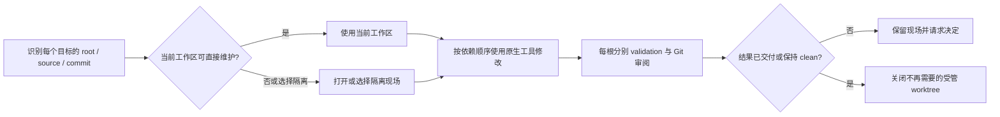

# 用户工作流

本篇负责说明调用方为何选择一个接口、如何推进任务、操作后能观察到什么，以及失败后
应作什么决定。精确参数与副作用以 [CLI 用户接口](interfaces/cli.md) 为准，结果字段以
[CLI JSON Schema](interfaces/cli-schema.md) 为准，概念属性和内部状态变化分别见
[领域模型](domain-model.md)与 [子系统及生命周期](subsystems-and-lifecycles.md)。

external 与 worktree 是可选的 doctidex-git 受管工作流。agent 可以改用原生 Git、手工
worktree、submodule、symlink 或其他满足任务与协议要求的方式；没有受管记录不构成读取、
维护或协议符合性失败。

## 1. 先选择工作方式与根

调用方先判断任务是否需要 doctidex-git 特有事实：普通阅读、搜索、编辑和 Git 审阅直接
使用原生工具；需要协议结构判断时使用 `validate`；需要可恢复的外部呈现或受管隔离现场
时，才进入 external 或 worktree 工作流。

root-scoped 命令必须得到一个明确 doctidex 根。显式 `ROOT` 或 `--root ROOT` 指向根目录
本身；省略时，命令按其输入从 cwd 或目标路径寻找唯一包含根。没有候选或嵌套根存在多个
合理候选时，调用方根据返回候选重试 exact root。cwd 只提供本次默认值，不形成 session，
也不限制原生工具访问范围。

## 2. 渐进阅读

**场景与理由**：agent 需要快速定位内容，同时保留 doctidex 的导航和边界语义；读取不应
依赖插件 session 或专用 reader。

**使用方式**：

1. 从任务已知路径、负责 `index.md` 或原生搜索开始。
2. 进入一个范围时读取最近负责 index 的 `boundary-set`、`atomic-indexing` 和 `unsafe`；
   下级 index 接管后不沿用祖先的局部配置。
3. 解析 Markdown 文件路径 link 时，把 `/` 当作当前 doctidex 根并作词法规范化。
4. 检查 link 后连续 HTML 注释序列中的 `doctidex:` mapping；其他注释不阻断关联。
5. 无论正在阅读主仓库还是 install 中的 doctidex 树，原生工具无法访问 symlink 时，先对
   symlink 自身运行 `doctidex-git external link-parse PATH --json`，不要立即把它判为损坏。
6. 需要确定性结构结论时运行 `validate`；只关注部分目录时再提供 `--scope`。

**可观察结果**：文件始终由普通文件工具读取；边界、atomic 和 unsafe 不建立读取禁区，
可达图也不限制原生搜索。读取不创建受管状态、不联网，也不因路径未受管而失败。

**失败与下一步**：路径或根语义不明确时先确定 exact root 和负责 index。link-parse 返回
`owner_install_missing` 时路由到 Maintenance 的 restore；返回
`dependency_not_installed` 时读取其 source/selector/commit 和
`dependency_parent_install_id`，再由 agent 决定是否进入 Maintenance 安装依赖；返回
available 时改用 `working_path` 继续原生读取。普通可访问路径不以 link-parse 为前置条件。

## 3. 校验整个根或关注目录

**场景与理由**：结构缺陷与内容判断需要分开；局部检查可以减少无关信息，但不能冒充
全根符合结论。

**使用方式**：运行 `doctidex-git validate`。省略 `--scope` 检查完整根；聚焦一组目录时，
为每个根绝对目录路径重复提供 `--scope`。读取结果时先判断 `coverage`、`scopes`、
`protocol_structure`、`scan_complete` 和 `semantic_review`，再处理 findings 与 candidates；
列表截断时使用返回 cursor 继续，而不是任意提高 limit。

**可观察结果**：protocol findings 是确定性结构问题，semantic candidates 留给 human 或
agent 阅读判断。scoped validation 会读取形成正确结论所需的祖先配置、导航和 link 目标，
但只返回所选目录内及直接阻止其解释的问题。`coverage: scoped` 下的 pass 只覆盖该范围
及其支持闭包；pass 不表示内容正确、可信或获得维护授权。

**失败与下一步**：root 选择失败或任一 scope 非法时，修正输入后重试；非法 scope 不回退
为全根扫描。必要 safe 路径不可读时，保留已完成扫描并按 finding 修复。普通 submodule、
手工 symlink 或未受管 external path 本身不产生 plugin-readiness 错误。

## 4. 引入外部 Git 来源

### 4.1 建立直接安装

**场景与理由**：外部 repository 需要稳定、可恢复的根内读取基准，同时其 checkout 载荷
不应进入宿主 repository 的 Git 追踪范围。

**使用方式**：先对 `external install --url URL` 运行默认 dry-run，审阅 source、selector、
固定 commit、planned paths 和宿主 Git 追踪状态；接受后以相同输入加 `--apply`。调用方不
提供安装目标。需要远端默认分支时可以省略 revision；需要另一 selector 时显式提供 commit、
tag 或 branch。

**可观察结果**：成功 apply 后，selected root 的 `/.doctidex` 下出现工具分配的稳定逻辑
只读 install path。安装载荷被宿主 Git 忽略，direct install 被写入可版本化恢复清单；CLI
不 stage 或 commit。省略 revision 只在首次选择时使用 remote default branch，此后 install
始终固定到当时的 commit。不同 selector 拥有不同 install，同 selector 重试复用原结果。

**失败与下一步**：source、network、credentials、revision、宿主 repository 或 Git 追踪
边界不成立时，命令保留已有结果并返回处理动作。tracked payload 或冲突 ignore 规则需要
用户用原生 Git 明确处理；命令不自动覆盖、替换或改变 Git index。

### 4.2 从安装内容继续引入依赖

**场景与理由**：agent 在一个 install 中读到进一步依赖并决定继续使用 doctidex-git；
依赖不能递归 checkout 到只读 install 内，环状关系也不能无限展开。

**使用方式**：再次调用 `external install`，并以 `--dependency-of INSTALL_ID` 指明发现依赖
的 parent。CLI 每次只建立调用方明确请求的一条边，不读取依赖文档或自动递归。

**可观察结果**：dependency install 与 parent 并列放在同一 selected root 的 `.doctidex`
下，不进入恢复清单。同 install key 被重复请求时复用既有节点，因此 self edge 和 cycle
会终止。宿主 repository 自身成为依赖时仍得到独立 fixed-commit install，不会折叠到当前
可写 working tree。需要 durable link 时，先用不带 `--dependency-of` 的同 source/selector
调用把 dependency-only install 提升为 direct。

install 内容中版本化的 external symlink 可以继续指向其原宿主的稳定内部路径；该物理
target 在只读快照中不存在是正常的。agent 从 link-parse 取得当前 outer parent install ID
和固定 dependency facts 后，若决定安装则使用 `--commit resolved_commit` 和
`--dependency-of dependency_parent_install_id` 在当前 owner root 扁平安装；不得重新解析
portable branch/tag，也不在 install 内恢复或改写 symlink。

**失败与下一步**：parent 不属于 selected root、记录损坏或 source 无法取得时，修正 parent
或访问条件后重试；其他已安装节点和已建立边保持有效。

### 4.3 建立可追踪入口

**场景与理由**：install repository 的根或子目录需要一个用户选择、可由宿主 Git 追踪的
根内入口。

**使用方式**：对受管 direct install 或既有 link 内的 `SOURCE_DIRECTORY` 调用
`external link SOURCE_DIRECTORY TARGET_PATH`，先审阅 dry-run，再显式 apply。agent 随后
补充适当的 Markdown link prose，并用原生 Git 审阅需提交的 frontmatter、manifest 和
symlink。

**可观察结果**：target 是指向稳定 install path 或其子目录的相对 symlink，并具有独立的
boundary/unsafe 声明和 repository-relative mapping。恢复原 install path 后，symlink 无需
修改即可重新工作。同 target/同 mapping 的重试幂等；link 不继承 source 入口的 safe 状态。

**失败与下一步**：dependency-only source 先提升为 direct。target 被占用、重叠、被 ignore、
source mapping 损坏或平台不支持 symlink 时，保留现场并选择新 target、修复追踪边界或
恢复 source；命令不隐式 replace，也不回退为目录复制。

### 4.4 恢复缺失安装

**场景与理由**：clone、clean 或本地载荷丢失后，版本化恢复清单仍在，而已提交 link 因
目标缺失暂时不可读。

**使用方式**：运行 `external restore`；可重复提供 `--install` 只处理特定 direct install，
省略时分页处理清单中的全部记录。先 dry-run，确认每项计划后 apply。

**可观察结果**：restore 只按清单中的 sanitized source、exact commit 和稳定原路径重建，
不重新发现 default branch 或解析 moving ref。每项独立报告 planned、restored、unchanged
或 blocked；成功项令既有 symlink 自行恢复，不重写或 stage symlink。

**失败与下一步**：清单整体缺失或不可识别时先恢复版本化文件；单项 source 不可访问、
路径冲突或载荷损坏时只处理该项，其他成功结果不回滚。清单发生变化导致 cursor 失效时，
从第一页重新读取。

### 4.5 识别受管路径与不可访问链接

**场景与理由**：agent 已到达某个目录或无法访问的 symlink，需要判断它是主仓库受管
presentation、install 仓库携带的 portable external link，还是没有可识别 mapping 的普通
路径。

**使用方式**：对目录或 symlink 自身运行 `external link-parse PATH`。显式 `--root` 选择
owner root；省略时，受管 install/link 从外层 presentation 恢复 owner root，即使 PATH
所在 install 内容自身也是一个 doctidex root。

**可观察结果**：命令离线、只读，返回 `mapping_origin`、owner/content root、target state、
source、selector、commit、repository-relative path 和当前外层 install facts。主仓库 target
存在或 install 内 dependency 已在 owner root 展开时，`working_path` 可直接交给原生工具。
install 内 portable link 尚无外层 dependency 时返回正常 `dependency_not_installed`，仍给出
可选安装所需的固定来源和 parent install ID。`managed: false` 只表示没有 current-owner 或
portable mapping。

**失败与下一步**：主仓库 durable link 的 target install 缺失时执行 restore；install 内
dependency 未展开时，由 agent 决定是否按返回 source、exact resolved commit 和 parent ID
执行带 `--dependency-of` 的 install。
只有 manifest/link/source/path 事实互相矛盾时才是 mapping damage。命令不 validation、
不 fetch、不改 symlink，也不授予读取或维护权限。

## 5. 维护当前仓库或打开隔离现场

### 5.1 先选择写入现场

任务目标位于 selected root 的当前宿主 Git working tree，且维护基准就是当前 commit 时，
agent 优先直接使用当前 working tree。先用原生 Git 检查 branch、status、现有变化、权限和
交付目标；`worktree open` 不是前置要求。

当目标是其他 source/revision、现有变化需要隔离、任务需要并行，或用户明确要求独立现场
时，agent 可以选择 doctidex-git 受管 worktree，也可以使用手工/原生 Git 方案。

### 5.2 打开、列出与关闭受管 Worktree

**使用方式**：用 `worktree open SOURCE` 和显式 revision 创建隔离现场。managed path 通常
使用 `link-parse` 返回的 fixed commit；其他 source 可以是 URL、working tree、bare gitdir
或 gitfile。用 root-scoped `worktree list` 查看受管现场，完成 Git 交付或恢复后，以 exact
managed path 调用 `worktree close`。

**可观察结果**：open 在 owner root 的 `/.doctidex` 下扁平创建 detached、可写 worktree；
即使 SOURCE 位于 install 或另一 worktree，也不在其中递归创建。payload 被宿主 Git 忽略，
但不进入 external 恢复清单。list 报告 clean、changed 或 unavailable；具体 diff 仍由原生
Git 查看。close 只移除可证明 clean 的受管现场。

**失败与下一步**：URL source 可能需要 network；其他 source 缺对象时不会改用无关 remote。
open 失败不产生 ready record。changed、unavailable、路径不 exact 或归属不明时，close
完整保留现场，由用户决定交付、恢复或人工处理。

## 6. 协调多根维护

调用方为每个根分别记录写入入口、base commit、授权、依赖、validation、diff 和交付动作。
相同 source/commit 只是复用候选，不证明权限或 branch 目标兼容。执行中发现新外部目标时，
重新识别 source 与 root，不沿只读 presentation 静默扩大当前写入范围。

跨根工作没有总事务。一个根 blocked 时，其他根已完成、无变化或已保存的结果继续有效；
同一根上的并行编辑由 agent 协调 ownership 与集成顺序。公共失败与保留原则见
[约束与失败模型](constraints-and-failures.md)。

## 7. 显式回收共享来源缓存

**场景与理由**：human 或 program operator 已确认某个 Git source 的共享 bare cache 可能
不再使用，需要回收 objects；仅凭 doctidex runtime record 或某个路径缺失不能证明其他根
没有仍有效的 linked worktree。

**使用方式**：以 source URL 运行 `doctidex-git cache clean --url URL --json`。命令默认
dry-run；先审阅 sanitized source、opaque cache source ID、linked/valid/prunable worktree
数量与 `state`，只有 `state: planned` 时才以相同 URL 加 `--apply`。该命令不选择 root，
cwd 不影响 source identity，也不是 Overview、Read 或 Maintenance Skill 路由的 agent
工作流。

**可观察结果**：有任一有效 linked worktree 时，命令以 warning 报告 `preserved`，无论该
worktree clean/dirty、是否有 doctidex record 或属于哪个 root。只有有效数量为零，且所有
剩余登记都由 Git 判为 prunable 时，dry-run 报告 `planned`，apply 在锁内复查后删除该单个
bare source cache 并报告 `removed`。公开 `changed` 保持为空，因为内部 cache path 不是
公共接口；install/worktree path、manifest、runtime record 和其他 source cache 始终不变。

**失败与下一步**：URL 未命中 source cache、bare repository metadata 损坏、任一 linked
registration 无法分类或锁内复查发现并发变化时，不删除并返回稳定 code。修正 URL、用
原生 Git 修复 metadata，或重新 dry-run 后再决定；重复 apply 到已删除 source 返回
`cache_source_not_found`，不声称再次删除成功。该命令全程离线，也不会为了将来重新安装
而预取 objects。
