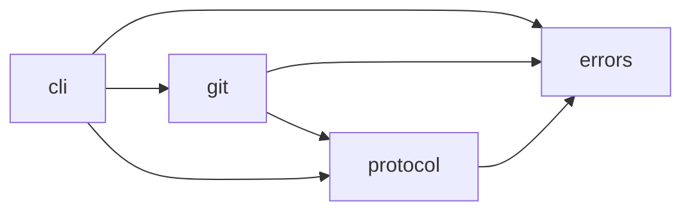

# Python 包与模块地图

本篇提供 `whero-doctidex` 的代码入口和依赖关系。行为细节由各专题文档负责，避免把
文件清单误当成设计说明。

## 1. 分发边界

distribution 名为 `whero-doctidex`，当前版本 `0.1.0`，要求 Python 3.11 以上。`whero`
是 PEP 420 namespace package，import 根为 `whero.doctidex`，console script 为
`doctidex-git = whero.doctidex.cli.main:main`。

直接依赖：`ruamel.yaml` 做 frontmatter round-trip，`markdown-it-py` 做 CommonMark
link 解析，`regex` 提供固定 VERSION1 方言。测试 extra 包含 pytest 和 Ruff。

Python imports 当前是实现内部协作面，不承诺为外部稳定 API。程序应使用
[CLI JSON](../../architecture/interfaces/programmatic-integration.md)。

## 2. 依赖方向



`protocol` 不依赖 Git；`git` 复用协议对象；`cli` 编排两者并拥有结果预算和进程边界。
禁止反向 import，以免协议解析隐含 Git 环境或 CLI schema 渗入 domain modules。

## 3. 全模块索引

| 模块 | 定位 | 详细设计 |
|---|---|---|
| `whero.doctidex.__init__` | 提供 `__version__`。 | 本篇。 |
| `errors` | `DoctidexError` 及 blocked payload 基础。 | [CLI 与 rendering](cli-and-rendering.md#6-doctidexerror) |
| `protocol.__init__` | 便捷导出 Document、Link、link parser 和路径规范化；`__all__` 明确四个名称。 | [协议实现](protocol.md) |
| `protocol.constants` | index/log 名和 mount namespace 常量。 | [协议实现](protocol.md) |
| `protocol.document` | Markdown/frontmatter round-trip 与 link 抽取。 | [协议实现](protocol.md#1-doctidexdocument) |
| `protocol.paths` | 内部路径规范化和文件系统转换。 | [协议实现](protocol.md#2-内部路径) |
| `protocol.regex` | VERSION1 regex 编译与 search wrapper。 | [协议实现](protocol.md#52-regex-编译) |
| `protocol.mounts` | 解析语言无关 mount 基础字段。 | [协议实现](protocol.md#6-基础-mount-解析) |
| `protocol.tree` | 根发现、PathContext、过滤匹配与受控遍历。 | [协议实现](protocol.md#3-根发现) |
| `protocol.validation` | 汇总结构 findings 与语义候选。 | [协议实现](protocol.md#7-协议校验) |
| `git.__init__` | 便捷导出 `GitMountService`；`__all__` 只含该名称。 | [Source 与 Mount](sources-mounts-and-projection.md#4-gitmounts) |
| `git.runner` | 非交互 Git 子进程与错误分类。 | [Context 与 State](git-context-and-state.md#2-gitrunner) |
| `git.context` | worktree/status/ignore readiness。 | [Context 与 State](git-context-and-state.md#3-gitcontext) |
| `git.relations` | root 自引用与同 revision maintenance scope 的保守关系判断。 | [Repository Relation](repository-relations.md) |
| `git.state` | 内部路径、JSON state、锁、反查和诊断。 | [Context 与 State](git-context-and-state.md#4-gitstate) |
| `git.repository` | 共享 source、selector、revision/maintenance worktree。 | [Source 与 Mount](sources-mounts-and-projection.md#2-gitrepository) |
| `git.projection` | 宿主相关只读镜像和 mount path 发布。 | [Source 与 Mount](sources-mounts-and-projection.md#3-gitprojection) |
| `git.mounts` | Git mount 声明与生命周期 service。 | [Source 与 Mount](sources-mounts-and-projection.md#4-gitmounts) |
| `git.setup` | init preview/apply。 | [Source 与 Mount](sources-mounts-and-projection.md#5-gitsetup) |
| `git.maintenance` | scope/open/status/handoff/close。 | [Maintenance](maintenance.md) |
| `cli.__init__` | CLI 子包说明，无导出对象。 | [CLI 与 rendering](cli-and-rendering.md) |
| `cli.main` | parser、根选择、dispatch、batch、budget、退出码。 | [CLI 与 rendering](cli-and-rendering.md) |
| `cli.render` | JSON 与人读渲染。 | [CLI 与 rendering](cli-and-rendering.md#7-rendering) |

## 4. 关键数据对象

| 对象 | 属性 | 所有者 |
|---|---|---|
| `DoctidexError` | message、operation、affected、result、actions、requires_user、code、details | `errors` |
| `MarkdownLink` | label、target、order | `protocol.document` |
| `DoctidexDocument` | path、data、body、newline；派生 doctidex/is_root | `protocol.document` |
| `RegexCompileError` | message、position | `protocol.regex` |
| `RootContext` | root、index | `protocol.tree` |
| `PathContext` | host/path/internal/source/scope/attributes 与责任边界字段 | `protocol.tree` |
| `MountDeclaration` | type、url、mount_path、raw | `protocol.mounts` |
| `GitResult` | stdout、stderr、returncode | `git.runner` |
| `RevisionSelector` | kind、value | `git.repository` |
| `GitMount` | declaration、selector；派生 mount_path/url | `git.mounts` |
| `StateStore` | root、directory、path、lock_path | `git.state` |
| `GitMountService` | context、root、store | `git.mounts` |
| `MaintenanceService` | context、root、store、mounts | `git.maintenance` |

属性的精确定义见表中模块对应专题。除 CLI schema 外，这些 dataclass/service 可以随
实现演进，不应由 Skills 暴露。

## 5. 一次命令的代码路径

```text
main(argv)
  -> global options + parser
  -> command-specific RootContext
  -> protocol function or Git service
  -> result dict / DoctidexError
  -> collection budget
  -> JSON or human rendering
  -> exit code
```

需要追踪 mount 的跨模块生命周期时读 [Git Runtime](git-runtime.md)；需要修改某一模块
时先读对应专题的职责、属性、错误和调用示例，再查看源码与测试。

## 6. 设计边界

- domain 模块返回客观对象或 payload，不生成语义内容。
- CLI 是唯一当前承诺的程序组合面；state 文件不是 API。
- 可读 projection 与 maintenance root 是不同写入边界，不得共用写接口。
- 新模块应放在协议、Git domain 或 CLI 编排中最窄的责任层，不能复制解析规则。
- 公共行为改变时同步 Architecture、Skills 和测试；纯内部重构只更新 Details。
