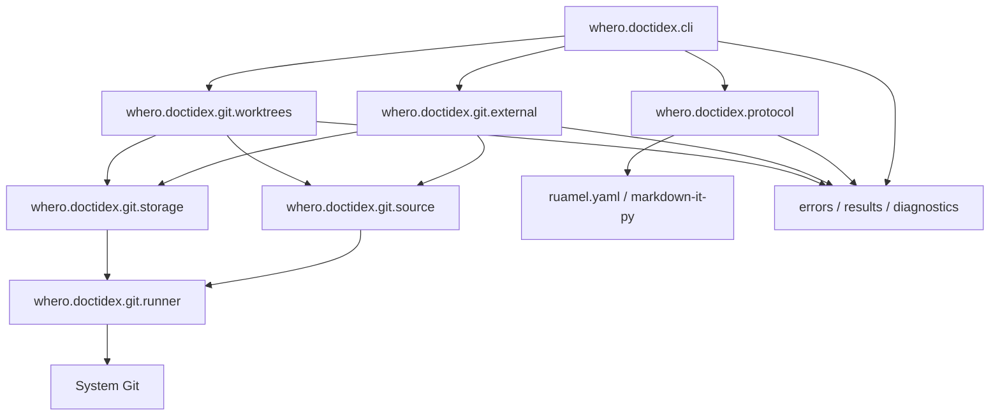

# Platform、package 与 dependencies

## 1. Artifact 与安装

[`impls/libs/python/pyproject.toml`](../../../../impls/libs/python/pyproject.toml)发布
`whero-doctidex==1.0.0`，要求 Python `>=3.11`，并把
`whero.doctidex.cli.main:main` 注册为 `doctidex-git` console script。Runtime dependencies 是
`markdown-it-py>=3,<5`、`ruamel.yaml>=0.18,<0.19` 和 PATH 中可执行的 Git。

Repository development 使用根 `.venv` 与 editable install；Published Skills 只假设已安装产品，
不包含 repository path 或 test command。Package import 不执行 filesystem/network discovery。

## 2. Package dependency graph

禁止反向依赖：protocol 不导入 `git.*`；source 不导入 protocol/root/storage；storage 只在方法内
延迟导入 runner/document 以避免把 Git/Markdown 变成 construction prerequisite；render 不导入
domain services。

## 3. Platform choices

| Concern | Realization | Failure boundary |
|---|---|---|
| Paths | `pathlib.Path/PurePosixPath`；Git absolute path output | root-internal 与 filesystem path 分离；非法 normalization blocked。 |
| Git | argument-array `subprocess`、`GIT_TERMINAL_PROMPT=0` | no shell；credentials 交给 Git helper，stderr 清理后分类。 |
| Cache root | override、Windows LocalAppData、macOS Caches、XDG | 物理路径 internal；public 只返回 opaque source identity/counts。 |
| File publication | same-directory temp、flush/fsync、`os.replace` | 单文件原子，workflow 非原子。 |
| Lock | atomic directory creation + bounded polling | cross-platform；timeout -> structured conflict。 |
| Symlink | native relative directory symlink | unsupported -> preflight blocked；无非等价 fallback。 |
| Read-only | clear ordinary write bits | best effort；不是 security boundary。 |

## 4. Delivery 与 verification

CI 在 Linux/macOS/Windows、Python 3.11/3.12 执行 editable install、Ruff 与 pytest。需要成功
symlink 的场景可按 runner capability 分支，但 unsupported path 仍有结构化 test。Package、CLI
和 Published Skills 必须共同发布兼容版本；JSON major 与 package version 独立但在当前均为
`1.0`。
