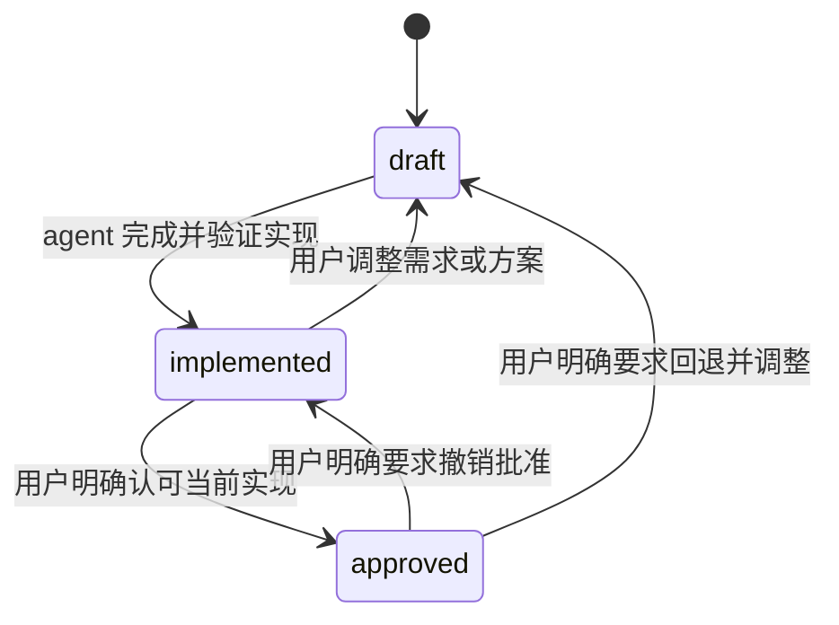

# 需求 0004：项目文档组织与 Requirement 生命周期

| 属性 | 值 |
|---|---|
| ID | `DX-REQ-0004` |
| 状态 | `implemented` |
| 日期 | 2026-07-30 |
| 来源 | 用户明确提出项目文档迁移、Requirement 维护规则和 review 规则调整 |
| 影响范围 | 仓库文档组织、全部 Requirements、仓库维护 Skills 与 review 输出 |
| 协议关系 | 非规范性仓库治理需求；不改变 [`doctidex` 协议](/spec/overview.md) |

本文要求将实现设计文档从 `impls/` 中分离，并建立项目共用的 Requirement 历史与明确
的实现确认生命周期。它同时约束仓库 review 的默认范围和协议合规性结论，避免普通
开发迭代被误作已获用户批准，也避免把协议未规定的实现选择误报为协议违规。

## 1. 文档组织

1. 原 `impls/docs/` 整体迁移为根级 `docs/`。
2. 原 `docs/doctidex-git/requirements/` 提升为 `docs/requirements/`，供整个项目共享。
3. Architecture 和 Details 继续按实现组织在 `docs/<implementation>/` 下。
4. Requirements 采用全项目连续文件编号；迁移时保留既有稳定 ID。
5. 根索引、父目录索引、跨层链接、维护说明和 Skills 必须使用新路径。

## 2. Requirement 状态

每份 Requirement 必须显示且只能使用以下小写状态：

| 状态 | 用户可观察含义 |
|---|---|
| `draft` | 用户与 agent 正在讨论需求和制定方案。 |
| `implemented` | agent 已按当前 Requirement 完成并验证实现，用户尚未确认。 |
| `approved` | 用户明确认可当前实现，可进入 PR/MR。 |

`draft` 与 `implemented` 可在批准前反复转换，这是正常开发过程。agent 不得从实现完成、
测试通过、review 结论、用户沉默或一般性肯定中推断 `approved`。只有用户明确要求才能
设置 `approved`，或把它回退到其他状态。

## 3. Draft 协作

当用户表达“创建需求”“记录需求”或语义等价的意图时，agent 应直接根据用户给出的初步
意图，在 `docs/requirements/` 创建下一个编号的 `draft` 文档。该意图本身就是记录授权；
agent 不应只在对话中返回提纲，也不应要求用户再使用某个固定句式确认创建。

agent 从用户意图出发补全 Requirement 的表达、约束与方案，不增加用户未要求的特性或
需求。真正需要继续讨论的决策可临时写为 `<question>...</question>`；用户在文档内回答
时，紧邻添加 `<answer>...</answer>`，也可以改在对话中回答。agent 将答案吸收到正文后，
应删除已解决的 question 与 answer 块；只有用户明确要求保留时才留下这些块。

## 4. Requirement 依赖

依赖、细化、取代和后续关系必须在两份相关 Requirement 中分别提供可导航链接，并写明
各自方向。索引可以汇总关系，但不能替代文档两端的链接。

本治理需求影响已有记录：

- [DXG-REQ-0001](0001-agent-git-plugin.md) 是迁移到共享目录的初始插件基线；其反向链接说明本记录治理其状态和位置。
- [DXG-REQ-0002](0002-root-self-reference-and-maintenance.md) 是迁移到共享目录的后续功能需求；其反向链接说明本记录治理其状态和位置。
- [DXG-REQ-0003](0003-maintenance-scope-semantics.md) 是迁移到共享目录的语义细化；其反向链接说明本记录治理其状态和位置。

## 5. Review 默认范围

1. 用户未明确指定范围时，只 review 当前任务中创建、修改、实现或明确作为依赖的活跃
   Requirement，并且只以其中状态为 `draft` 或 `implemented` 的记录作为目标。
   “review 当前仓库/当前变更”这类泛化请求本身不覆盖该默认筛选。
2. `approved` Requirement 可以作为防止回归的支持性权威读取，但不属于默认 review
   目标；用户可以显式把它纳入范围。
3. 当前任务没有活跃的非 `approved` Requirement 时，review 开始前必须请用户指定范围。

## 6. 协议合规性分级

协议合规性 finding 必须指向实际存在的规范性规则。协议没有规定某项行为时，实现增加
功能或选择具体机制本身不构成不符合。若把该行为纳入协议具有很高价值，可以给出
`advisory` / `recommended` 的规范建议，但不得仅因协议未规定就给出 `high` / `must_fix`。

## 7. 落实结果

| 层面 | 结果 |
|---|---|
| Repository tree | `docs/` 位于项目根，`docs/requirements/` 为共享历史。 |
| Existing Requirements | 0001–0003 保留稳定 ID，状态统一为 `implemented`，并补充双向关系。 |
| Documentation rules | `AGENTS.md` 与文档编写 Skill 定义创建意图触发、三态、draft 协作和依赖链接。 |
| Review rules | review Skill 定义默认活跃范围与协议 unspecified 的 advisory 边界。 |
| Navigation | 根、实现、文档和 Requirement 索引及跨层链接均指向新位置。 |

## 8. 验收标准

1. Git 不再跟踪 `impls/docs/`，全部原文档可从根级 `docs/` 进入。
2. `docs/requirements/` 是唯一 Requirement 目录，现有记录和本记录均可导航。
3. 所有 Requirement 状态均属于三个允许值，且没有未经用户明确指令的 `approved`。
4. “创建需求”及语义等价的用户意图会直接创建下一编号的 `draft` 文档。
5. 现有 Requirement 关系从任一端都能追踪，Architecture 与 Details 的回链有效。
6. 文档与 review Skills 通过本地 Skill 校验。
7. review 默认范围和协议 unspecified 的 finding 分级通过独立场景前向测试。
