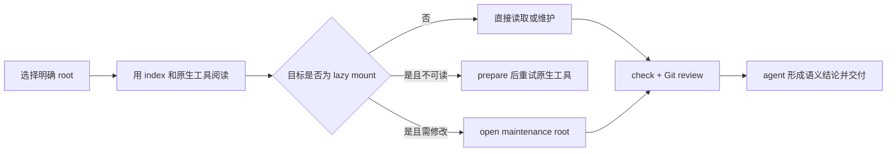

# 用户工作流

本文按实际任务说明 `doctidex-git` 为什么提供一项能力、用户如何使用、完成后能观察到
什么，以及失败时如何继续。精确参数见 [CLI 用户接口](interfaces/cli.md)，字段含义见
[CLI 结果契约](interfaces/cli-schema.md)。

所有工作流都遵循同一个分工：原生文件、搜索、编辑和 Git 工具负责观察与修改现场；
CLI 提供根、路径、mount、revision、范围和校验等客观事实；人或 agent 负责理解内容、
撰写 index/log 和决定 Git 交付动作。

## 1. 建立或接管目录树

**问题与场景**：已有 Git 工作目录需要成为 doctidex 根，但正文、现有 frontmatter 和
Git 历史不能被工具擅自重写。

**使用方式**：先运行 `doctidex-git init PATH --dry-run --json` 检查目标根和
`planned_changes`，确认范围后再以 `--apply` 执行。agent 随后使用自己的编辑工具撰写
根 `index.md` 正文，并审阅直接子项是否应被索引。

**可观察结果**：根 index 获得必要标记和 mount exclude；根 `.gitignore` 覆盖
`/.doctidex/mounts/`；CLI 不生成正文、不 commit，也不访问网络。

**失败与动作**：`root_ambiguous` 要求传入精确根；目标不在 Git 工作目录时应向用户
确认正确位置；现有结构无法安全接管时保留文件并报告受影响路径。

**设计理由**：preview 把结构性写入与语义创作分开，让用户先确认范围，再由 agent
完成需要理解内容的部分。

## 2. 渐进阅读与自由探索

**问题与场景**：大型目录树需要可靠入口，但强制所有读取经过专用 reader 会削弱
agent 已有文件工具，并增加无意义调用。

**使用方式**：从根 `index.md` 开始，根据正文索引和 link 缩小范围；需要确认负责
index、适用 log、过滤属性或 mount 来源时调用 `inspect PATH --json`。实际读取、搜索
和目录浏览继续使用 agent 的原生工具。信息不足时可自由扩大搜索，不需要 CLI 授权。

**可观察结果**：`path_context` 给出 `internal_path`、`host_scope`、`attributes`、
`responsible_index`、`applicable_log` 和 mount 归属；负责 index 的机器可解析 links 与
语义候选作为导航辅助返回。

**失败与动作**：无根不等于文件不可读，普通探索可继续；根不唯一时精确指定目标。
`protected`、`atomic` 和 `excluded` 不阻止读取，但在写入前必须遵守其维护语义。

**设计理由**：doctidex 是导航与责任层，不是文件访问网关。

## 3. 解析绝对内部 link

**问题与场景**：Markdown 中 `/guide/index.md` 表示相对于 link root 的内部路径，不是
操作系统根；mount 文档的 link root 又可能与当前 cwd 所在宿主根不同。

**使用方式**：同根且 root 已知时，直接把规范化内部路径映射到该根，无需每个 link
都调用 CLI。以下情况推荐运行
`doctidex-git resolve INTERNAL_PATH --from LINK_DOCUMENT --json`：

- link 来源是经 `/.doctidex/mounts/...` 访问的外部文档，而 cwd 仍在宿主根；
- 路径包含 `..` 或 mount namespace 回边，需要确认规范化结果；
- 需要同时确认目标是否跨 mount、mount 是否可读和精确恢复动作。

`LINK_DOCUMENT` 是包含该 link 的、当前可访问的文件路径，不是要求调用者推断的 root。
相对 link 继续按文档目录用普通文件工具解析；anchor 不作为 `INTERNAL_PATH` 传入。

**可观察结果**：`link_root` 说明解析基准，`working_path` 可直接交给原生工具，
`crosses_mount` 和 `mount` 说明是否依赖 lazy mount。

**失败与动作**：`root_ambiguous` 时不要猜最近根，应从精确宿主或 source root 重试。
目标 mount 未准备不使 resolve 本身失败；按返回的 `next_action` 恢复后再读取。

**设计理由**：cwd 为普通单根操作提供低参数成本，`--from` 则消除跨 mount 阅读时
来回切换 cwd 的负担。

## 4. 按需恢复外部目录树

**问题与场景**：mount 声明存在，但为避免启动时拉取全部远端，文件可能尚未出现在
逻辑路径。用户不能把这种情况误判为源文件缺失，也不能被迫使用专用 reader。

**使用方式**：只有任务必须读取且原生工具发现目标不可用时，先用 `inspect`、
`resolve` 或 `mount list` 确认所属 mount。若为 `not_prepared`，执行
`doctidex-git mount prepare MOUNT_PATH --json`，成功后以原来的逻辑路径重试原生工具。

| 观察状态 | 含义 | 下一步 |
|---|---|---|
| `not_prepared`，无 effective commit | 尚未选出读取快照。 | prepare；必要时取得网络或凭据。 |
| `not_prepared`，有 effective commit | 已知快照，但逻辑路径当前不可读。 | prepare 恢复同一快照。 |
| `ready` 且 `readable: true` | mount 可由普通文件工具读取。 | 直接读取，不要为此 sync。 |
| mount ready，但具体文件不存在 | mount 已物化，目标可能确实不在该 revision。 | 检查 source 内容和声明 revision。 |

**可观察结果**：prepare 后 `effective_commit` 不变或首次确定，mount path 可正常读取；
tracked 文件、根 index 和 Git index 不应因此变化。

**失败与动作**：网络、凭据或 revision 失败时，CLI 区分需要 agent 重试和需要用户提供
信息的情况；已有可读快照必须保留。若最终无法提供正常文件读取，应把 mount、原因、
已保留结果和可采取动作直接反馈用户。

**设计理由**：lazy mount 降低无关网络与存储成本，同时以“最终仍可用普通工具读取”
作为恢复能力的产品底线。

## 5. 添加与移除 mount

**问题与场景**：外部 doctidex 根需要成为宿主的稳定逻辑依赖，而声明变更不能隐含
联网、写入 Git 索引或留下悬空引用。

**添加方式**：运行 `mount add` dry-run，检查清理后的 source、唯一 revision selector
和规范 mount path；得到授权后 apply。添加只写根 index，状态保持 `not_prepared`，
真正读取时再 prepare。

**移除方式**：运行 `mount remove MOUNT_PATH --dry-run`。确认宿主 Markdown 中没有可
解析引用并获得授权后 apply，再审阅根 index 和 Git diff。

**可观察结果**：声明变化只出现在根 index；mount namespace 始终被根 `.gitignore`
覆盖；未 apply 时公开文件不变。

**失败与动作**：路径重叠、非法 revision、Git ignore 未就绪或 namespace 已被跟踪时
不写入。已有引用时先由 agent 判断是更新链接、保留 mount，还是请求用户决策。

**设计理由**：声明、恢复与同步是三个独立动作，使配置写入可审阅、网络行为显式、
内容引用不会被静默破坏。

## 6. 显式同步 revision

**问题与场景**：branch 或 tag 可能移动，但普通阅读需要可重复，更新又需要可审阅。

**使用方式**：`mount list` 只确认本地有效快照。需要检查远端时运行 `check --online`
或 `mount sync MOUNT_PATH --dry-run --json`；比较 old/new commit，得到用户授权后以
`--apply` 切换。commit selector 通常不需要周期同步。

**可观察结果**：dry-run 可联网但不切换读取结果；apply 只更新目标 mount。其他即使
同源但仍指向旧 revision 的 mount 保持原 effective commit。

**失败与动作**：远端不可达或 revision 无法解析时，不丢弃旧可读 commit。报告旧结果
是否仍可用、需要的凭据或 revision 决策；不要以反复 prepare 代替 sync。

**设计理由**：声明意图与实际读取快照分离，避免 branch 漂移悄悄改变当前知识现场。

## 7. 维护宿主本地内容

**问题与场景**：本地文档需要修改，同时必须确认负责 index、log、protected 或 atomic
边界，并保持内容导航可渐进披露。

**使用方式**：用 `inspect` 确认路径上下文，在 included 范围使用原生工具编辑；按
任务语义更新正文、负责 index 和必要的 log。完成后运行 `changes` 与 `check`，结合
diff 处理 findings 和 semantic candidates。

**可观察结果**：Git diff 只包含用户授权范围；协议结构有独立 pass/fail；语义候选由
agent 阅读后形成结论，而非由 CLI 自动补写内容。

**失败与动作**：protected 范围没有明确授权时停止写入并询问用户；excluded 范围不纳入
宿主维护；atomic 单元作为整体理解。协议 finding 先按 action 修复，语义候选不能机械
转成文本。

**设计理由**：结构事实可自动化，内容质量和维护意图必须保留给人或 agent 判断。

## 8. 维护 mounted source

**问题与场景**：宿主 mount path 是只读入口，直接修改会混淆宿主与源的 diff，并可能
影响复用同一快照的其他引用。

**使用方式**：

1. `maintenance scope PATH...` 确认独立维护单位；
2. source 无 effective commit 时先 prepare；
3. `maintenance open MOUNT_PATH`，记录返回的 `maintenance_root`；
4. 只在该可写根使用原生编辑、搜索和 Git 工具；
5. 以 source 自己的 index、log 和过滤边界完成维护；
6. 运行 `maintenance handoff MAINTENANCE_ROOT --json`；
7. 根据用户授权处理 commit、push、merge 或宿主 selector 更新；
8. Git 状态 clean 后运行 `maintenance close MAINTENANCE_ROOT`。

集中在一个 source 的工作量较大、步骤较多时，推荐 `cd` 到返回的维护根开展工作，以
简化后续省略路径的命令；短暂跨根协调时可保留 cwd 并显式传维护根。

**可观察结果**：source 有独立 base commit、Git changes、校验和交付提示；宿主 mount
和其他引用不随编辑现场变化。`target_branch` 只是交付提示，不表示已自动切换分支。

**失败与动作**：未 prepare 时先恢复；选择不唯一时传精确维护根；存在 changes 时
close 必须拒绝并保留现场。CLI 不代替用户执行 commit、push、merge 或清理。

**设计理由**：读视图与写现场分离，使每个 source 的责任、diff 和交付动作保持清楚。

## 9. 协调多根任务

**问题与场景**：一次需求可能同时影响宿主及多个 source，它们具有不同仓库、基准和
权限，不能伪装成原子写入。

**使用方式**：用 `maintenance scope PATH...` 去重并得到独立 units。为每个 unit 记录
root、base commit、可写入口、diff、校验结果和待授权 Git 动作；按依赖顺序逐根完成。
批量 prepare/sync 的每个 item 也按独立结果解释。

**可观察结果**：每个根都有单独成功或失败状态。顶层 batch blocked 不撤销已成功项，
`completed_count` 与逐项 `result` 说明已保留内容。

**失败与动作**：只重试失败 unit；向用户分别报告各根已完成、仍保留和需要决策的
事项。不得用一个根的 pass 掩盖另一个根的失败。

**设计理由**：跨仓库没有真实总事务，公开独立结果比制造一致性假象更可靠。

## 10. 校验、审阅与交付

**问题与场景**：结构错误、需要阅读判断的候选和 Git 插件前置条件代表不同问题，混成
一个“失败”会让 agent 无法选择动作。

**使用方式**：运行 `check PATH --json`，按三个域分别处理：

| 结果域 | 表示什么 | 使用方式 |
|---|---|---|
| `protocol_structure` | 确定性结构检查是否发现 error。 | `fail` 时按 finding 修复；`pass` 不证明正文语义或目标存在。 |
| `semantic_review` | 是否有需阅读判断的候选。 | 打开候选、负责 index、适用 log 与 diff，形成自己的结论。 |
| `plugin_readiness` | Git mount 前置是否允许安全操作。 | 处理 ignore、tracked 内容或授权，不改写协议结论。 |

随后使用 `changes` 或 source 的 `maintenance handoff` 检查 Git 现场。确认 index 能支持
检索和渐进阅读、正文保持精炼分层、必要 log 已由 agent 撰写，再向用户交付结果。

**可观察结果**：结构 finding、语义候选和 readiness 各自保留；退出码不能代替读取三
个域。CLI 不生成语义结论、不提交 Git。

**失败与动作**：tracked mount 内容涉及 Git index 变更，必须由用户决定；不可恢复的
失败直接报告用户层原因、受影响范围、已保留结果和动作，不暴露内部堆栈。

**设计理由**：把客观失败与主观审阅分开，既能自动化确定性检查，又避免错误地替 agent
判断内容质量。

## 11. 离线工作与结果规模

普通 context、inspect、resolve、list、changes、离线 check 和已有快照的读取不应主动
同步远端。prepare 在本地结果不足时、sync 和 online check 可能联网；调用前应确认任务
是否允许。联网失败时优先继续使用明确保留的 effective commit。

所有列表都可能受 `--limit` 截断。读取 `collection` 中的总数、返回数、分组和
`next_cursor`；优先用更精确 PATH、单 mount 或单维护根缩小请求，再原样回传 cursor。
不要因当前页为空断言全量为空，也不要默认把 limit 提高到可能挤占上下文的规模。

